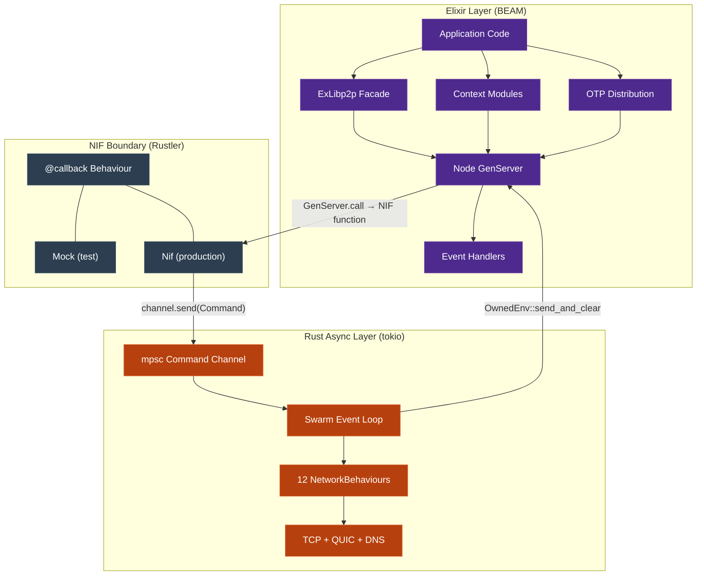
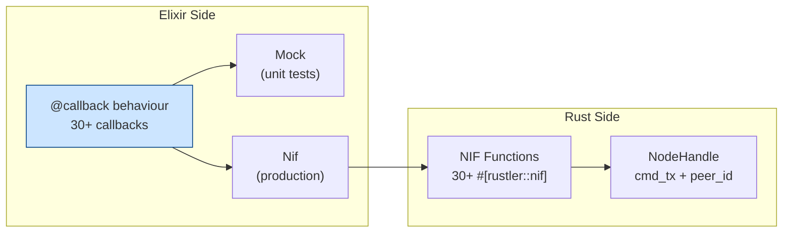
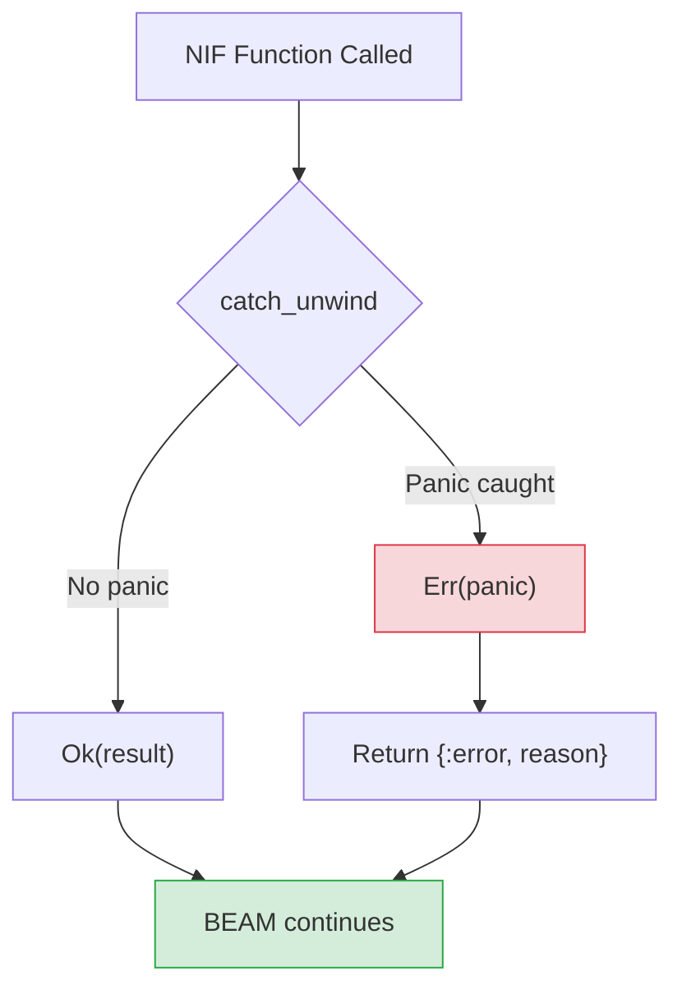
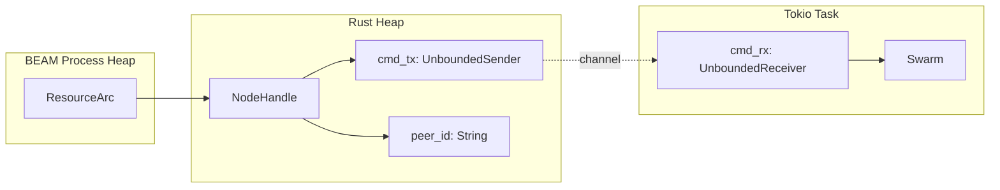
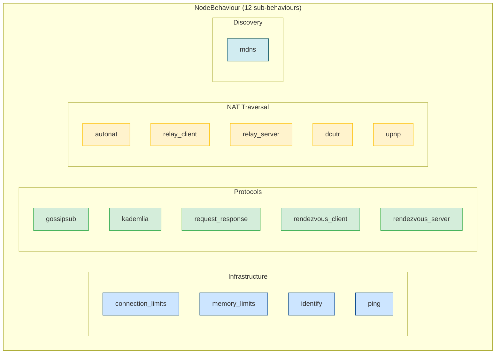
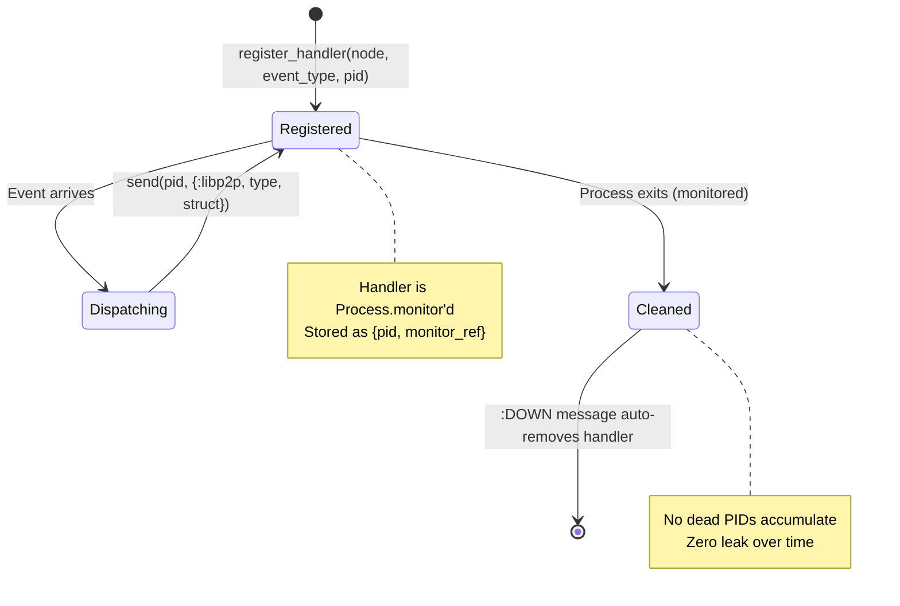
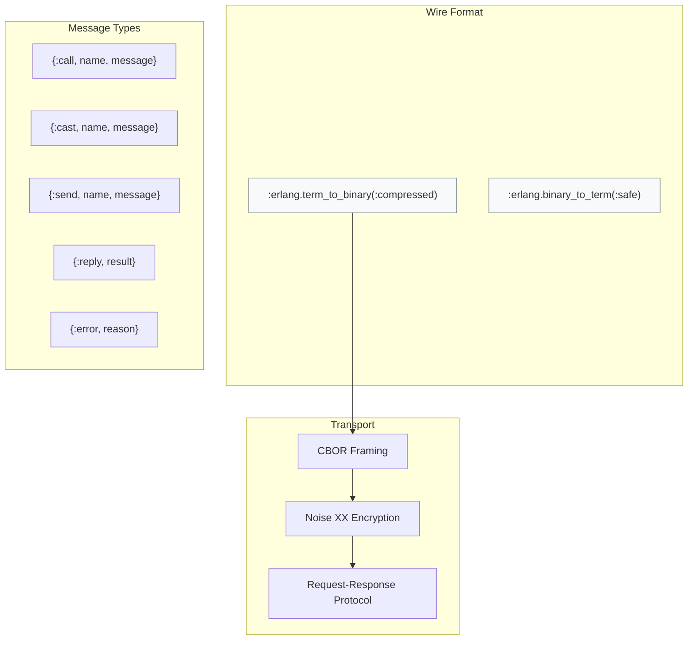
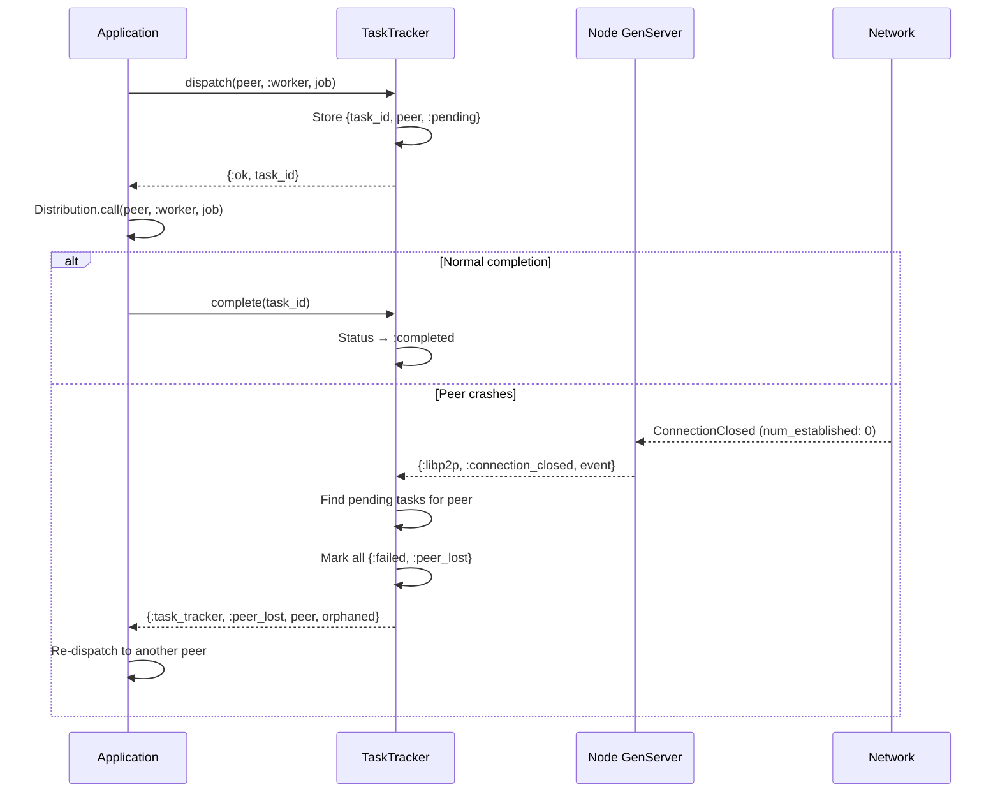
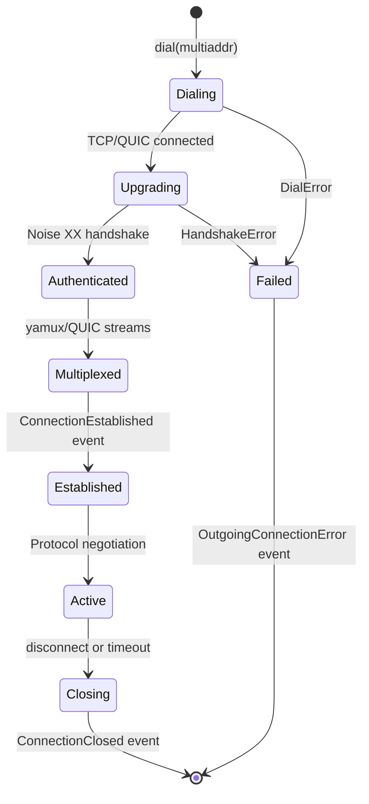
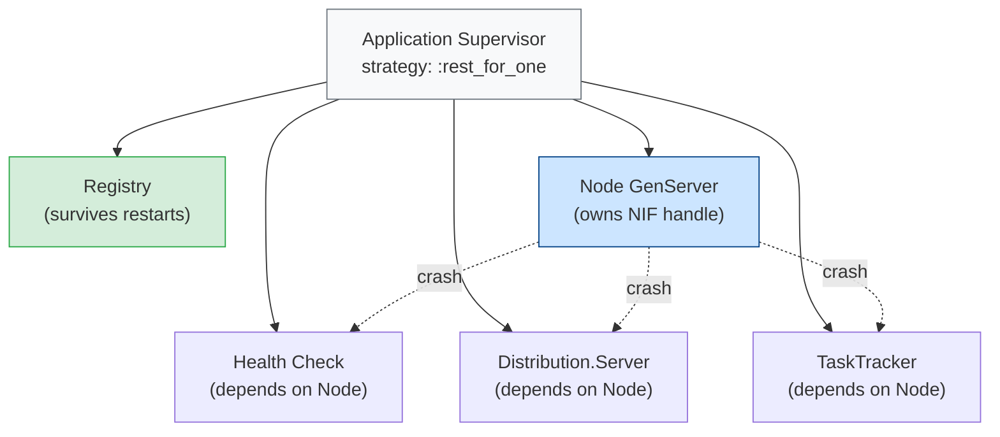

# ExLibp2p Architecture

Deep technical reference for the ExLibp2p architecture — three-layer design,
data flow, NIF boundary, Rust async runtime, event system, supervision,
security model, and failure handling.

## Layer Model



### Why Three Layers

| Layer | Runs on | Responsibility | Failure domain |
|-------|---------|---------------|----------------|
| **Elixir** | BEAM scheduler | API, supervision, event dispatch | OTP restart |
| **NIF Boundary** | BEAM dirty scheduler | Type conversion, scheduler safety | `catch_unwind` |
| **Rust Async** | tokio worker threads (2) | Swarm I/O, protocol state machines | Task panic → logged |

The key constraint: the libp2p `Swarm` is `!Sync` — it cannot be shared across threads.
This forces the command channel pattern: NIFs never touch the Swarm directly.

## Data Flow

### Commands (Elixir → Rust)

```mermaid
sequenceDiagram
    participant App as Application
    participant GS as GenServer
    participant NIF as NIF Function
    participant Chan as mpsc Channel
    participant Loop as Swarm Loop

    App->>GS: GenServer.call(node, {:publish, topic, data})
    GS->>NIF: native.publish(handle, topic, data)
    Note over NIF: Runs on normal BEAM scheduler<br/>(< 1ms, no blocking)
    NIF->>Chan: cmd_tx.send(Command::Publish{...})
    NIF-->>GS: :ok
    GS-->>App: :ok
    Chan->>Loop: tokio::select! receives command
    Loop->>Loop: gossipsub.publish(topic, data)
```

Fire-and-forget commands (dial, publish, subscribe) return `:ok` immediately.
The NIF enqueues the command and returns — the swarm processes it asynchronously.

### Queries (Elixir → Rust → Elixir)

```mermaid
sequenceDiagram
    participant App as Application
    participant GS as GenServer
    participant NIF as NIF Function
    participant Chan as mpsc + oneshot
    participant Loop as Swarm Loop

    App->>GS: GenServer.call(node, :connected_peers)
    GS->>NIF: native.connected_peers(handle)
    Note over NIF: Runs on DirtyCpu scheduler<br/>(blocks until reply)
    NIF->>Chan: cmd_tx.send(ConnectedPeers{reply: oneshot})
    Chan->>Loop: tokio::select! receives command
    Loop->>Loop: swarm.connected_peers().collect()
    Loop->>Chan: oneshot.send(peers)
    Chan-->>NIF: rx.blocking_recv() → peers
    NIF-->>GS: Vec<String>
    GS-->>App: {:ok, [%PeerId{}, ...]}
```

Query commands carry a `oneshot::Sender` for the reply. The NIF blocks on `blocking_recv()`
which is why it runs on a dirty scheduler — never block a normal BEAM scheduler.

### Events (Rust → Elixir)

```mermaid
sequenceDiagram
    participant Net as Network
    participant Loop as Swarm Loop
    participant Env as OwnedEnv
    participant GS as Node GenServer
    participant Handler as Event Handler

    Net->>Loop: SwarmEvent::Behaviour(...)
    Loop->>Env: OwnedEnv::new()
    Env->>Env: Encode event as Elixir term
    Env->>GS: send_and_clear(&pid, term)
    Note over Env: OwnedEnv allocates ~4KB<br/>Released after send_and_clear
    GS->>GS: handle_info({:libp2p_event, raw})
    GS->>GS: Event.from_raw(raw) → struct
    GS->>Handler: send(pid, {:libp2p, type, struct})
```

Events flow from the tokio swarm loop to Elixir via `OwnedEnv::send_and_clear`.
This is the **only safe way** to send from a non-BEAM thread to a BEAM process.
`send_and_clear` MUST NOT be called from a BEAM-managed thread (panics).

## NIF Boundary Design



The `ExLibp2p.Native` behaviour defines the port (hexagonal architecture).
Config swaps the adapter:

| Environment | Module | How |
|-------------|--------|-----|
| Production | `ExLibp2p.Native.Nif` | `config/config.exs` |
| Test | `ExLibp2p.Native.Mock` | `config/test.exs` |
| Integration test | `ExLibp2p.Native.Nif` | `NifCase` helper overrides |

### Scheduler Safety

| Scheduler | NIF duration | Used for |
|-----------|-------------|----------|
| **Normal** | < 1ms | Fire-and-forget: dial, publish, subscribe, stop |
| **DirtyCpu** | 1-100ms | Query: connected_peers, mesh_peers, keypair_from_protobuf |
| **DirtyIo** | 10ms-1s | Start: start_node (creates runtime, binds listeners) |

A NIF that blocks a normal scheduler for > 1ms stalls the entire BEAM scheduler
thread — causing process starvation across the VM.

### Panic Safety



Two layers of panic protection:

1. **`start_node`**: `std::panic::catch_unwind` wraps the entire node construction.
   Panics return `{:error, "NIF panic caught..."}` instead of crashing the BEAM.

2. **Swarm loop**: `FutureExt::catch_unwind` wraps the async event loop.
   If the swarm loop panics, it's logged via `tracing::error!` and the
   task stops — but the BEAM and tokio runtime survive.

Rustler 0.36+ also catches panics by default, but explicit `catch_unwind`
provides defense-in-depth.

## NodeHandle and ResourceArc



The `NodeHandle` stored in `ResourceArc` holds only:
- `cmd_tx`: the sending half of an unbounded mpsc channel
- `peer_id`: cached base58 string (immutable after creation)

The Swarm lives exclusively in the tokio task — never exposed to the NIF.
When `NodeHandle` is dropped (Elixir GC or explicit stop), its `Drop` impl
sends `Command::Shutdown` through the channel to cleanly stop the swarm loop.

## NetworkBehaviour Composition



The `#[derive(NetworkBehaviour)]` macro generates:
- `NodeBehaviourEvent` enum with one variant per sub-behaviour
- Composed `ConnectionHandler` via nested `ConnectionHandlerSelect`
- Delegation of all `NetworkBehaviour` trait methods

### Event Routing

The swarm loop dispatches events by matching the generated enum:

```
SwarmEvent::Behaviour(NodeBehaviourEvent::Gossipsub(...)) → events.rs
SwarmEvent::Behaviour(NodeBehaviourEvent::Kademlia(...))  → events.rs
SwarmEvent::Behaviour(NodeBehaviourEvent::RequestResponse(Message::Request{...}))
    → node.rs (extracts ResponseChannel, stores in HashMap, sends to Elixir)
SwarmEvent::ConnectionEstablished{...} → events.rs
SwarmEvent::ConnectionClosed{...}     → events.rs
```

Request-response inbound requests get special handling: the `ResponseChannel`
is `!Clone` and must be extracted before encoding the event for Elixir.
It's stored in a `HashMap<String, ResponseChannel>` keyed by a monotonic
channel ID (`"ch-1"`, `"ch-2"`, ...).

## Event Handler Lifecycle



Each registered handler is `Process.monitor`'d. When the handler process exits,
the `:DOWN` message triggers automatic cleanup — the handler is removed from the
`event_handlers` map and the monitor ref is removed from the `monitors` reverse index.

Re-registering the same PID for the same event type is a no-op (checked via
`List.keymember?`). This prevents duplicate delivery.

## OTP Distribution Protocol



### Security Properties

| Property | Mechanism |
|----------|-----------|
| **Confidentiality** | Noise XX (X25519 + ChaChaPoly) — every connection |
| **Authentication** | PeerId = Ed25519 public key hash, verified in handshake |
| **Integrity** | ChaCha20-Poly1305 AEAD — tamper detection |
| **Atom safety** | `binary_to_term(:safe)` rejects unknown atoms |
| **Open mesh** | Any authenticated peer can call any registered GenServer |

The `:safe` option for `binary_to_term` is critical: without it, a malicious peer
could send terms with new atoms, exhausting the BEAM's atom table (which is never GC'd).
With `:safe`, only atoms that already exist in the VM are accepted.

## Task Tracker and Peer Loss Detection



The TaskTracker only fires `:peer_lost` when `num_established` drops to 0 —
meaning the **last** connection to that peer is gone. If the peer has multiple
connections (e.g., TCP + QUIC), losing one doesn't trigger the notification.

## Connection Lifecycle



### Connection Limits

Three layers of protection:

| Layer | Mechanism | Default |
|-------|-----------|---------|
| **Count limits** | `connection_limits::Behaviour` | 256 in, 256 out, 2 per peer |
| **Memory limits** | `memory_connection_limits::Behaviour` | 90% system memory |
| **Idle timeout** | `SwarmConfig` | 60 seconds |

When limits are reached, new connections are denied — the peer receives a
`ConnectionDenied` error. Existing connections are not affected.

## Supervision Strategy



**`rest_for_one`** means: if the Node crashes, Health, Distribution.Server,
and TaskTracker all restart (they depend on the Node). But the Registry
survives — it was started before Node.

### What Happens on Node Crash

1. BEAM detects the GenServer process exit
2. Supervisor restarts Node (new PID, new NIF handle, new Swarm)
3. Health, Distribution.Server, TaskTracker restart and re-register with new Node
4. **The tokio runtime survives** (`OnceLock<Runtime>` is process-independent)
5. Old swarm loop receives `Command::Shutdown` from `NodeHandle::Drop`
6. New node gets a new PeerId (unless keypair was persisted)

### Tested Recovery

The panic safety test suite verifies:
- BEAM survives invalid NIF inputs
- BEAM survives rapid create/destroy cycles
- BEAM survives concurrent operations during shutdown
- Full functionality (gossipsub, DHT, subscribe) works after crash + restart
- Supervisor auto-restarts node with same registered name

## Rust Crate Architecture

```
native/ex_libp2p_nif/src/
├── lib.rs          NIF entry point, 30+ #[rustler::nif] functions
├── node.rs         NodeHandle, start_node_inner, swarm_loop
├── behaviour.rs    #[derive(NetworkBehaviour)] with 12 sub-behaviours
├── commands.rs     Command enum (all messages from NIF to swarm loop)
├── events.rs       SwarmEvent → Elixir term translation
├── config.rs       NodeConfig parsed from Elixir map
└── atoms.rs        Rust atoms matching Elixir atoms
```

| File | SRP | Changes when... |
|------|-----|-----------------|
| `lib.rs` | NIF function signatures | New NIF function added |
| `node.rs` | Swarm construction + event loop | New command handled, builder changed |
| `behaviour.rs` | Behaviour composition | New protocol added |
| `commands.rs` | Command enum definition | New command type |
| `events.rs` | Event encoding | New event type to send to Elixir |
| `config.rs` | Config parsing | New config field |
| `atoms.rs` | Atom definitions | New atom needed |

Adding a new protocol touches all 7 files — this is inherent to the
NIF boundary pattern, not a design flaw. Each file has a single reason
to change (its own concern), and the changes are mechanical.

## Performance Characteristics

| Operation | Latency | Scheduler |
|-----------|---------|-----------|
| NIF call overhead | ~100-200ns | Normal |
| Command channel send | ~10ns | Normal |
| Oneshot round-trip | ~2-20μs | DirtyCpu |
| `OwnedEnv` allocation | ~4KB | tokio thread |
| Noise XX handshake | ~1-5ms | tokio thread |
| GossipSub publish | ~10-100μs | tokio thread |
| Kademlia lookup | ~100ms-10s | tokio thread (async) |

### Bottleneck Analysis

The Node GenServer is a single process — all API calls are serialized through it.
This is intentional (single writer to the NIF handle), but under extreme load
(>10K calls/second), the GenServer mailbox can back up.

Mitigations:
- `peer_id` is cached in `NodeHandle` — no channel round-trip
- Fire-and-forget commands return immediately
- `connected_peer_count` could use `Arc<AtomicUsize>` for lock-free reads
- For read-heavy workloads, cache state in ETS
