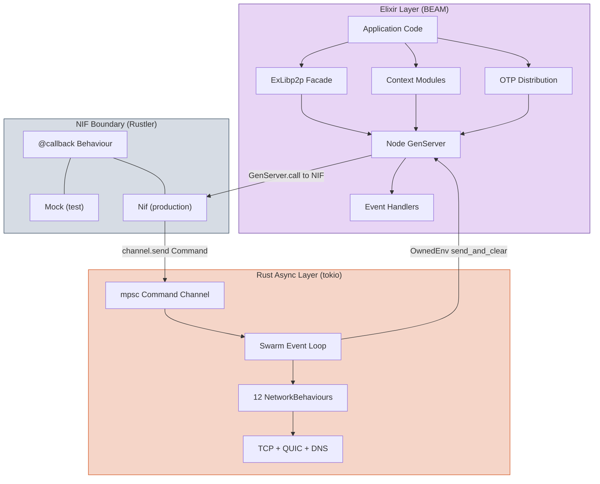
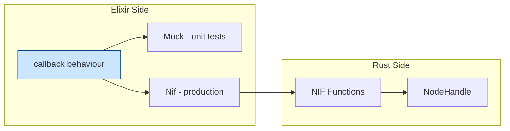
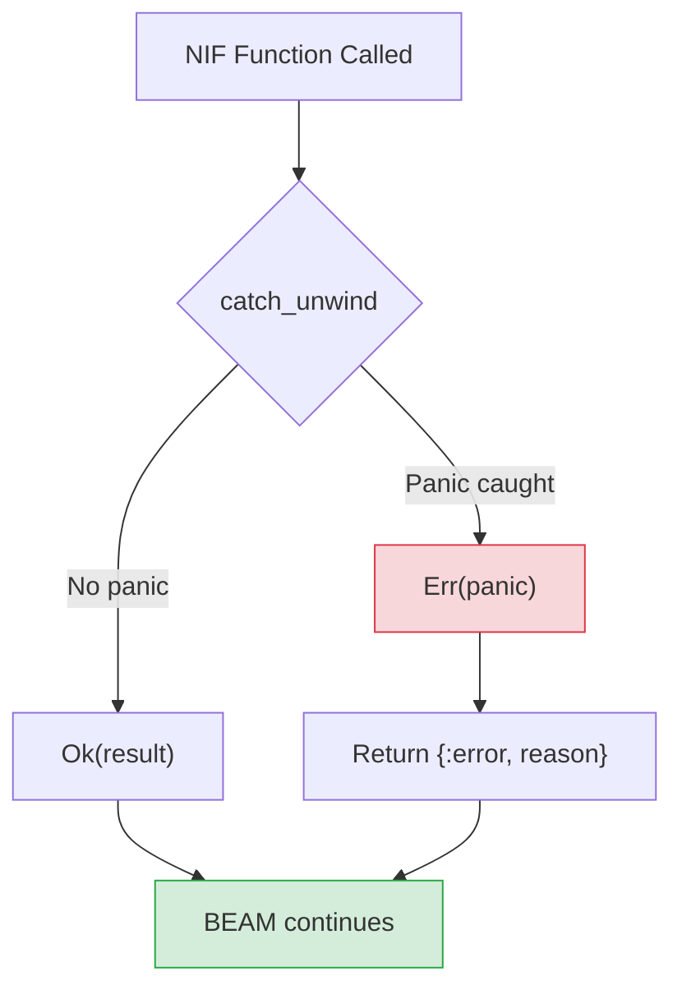
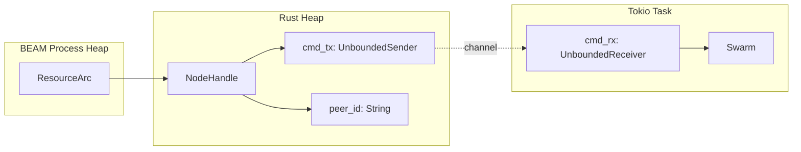
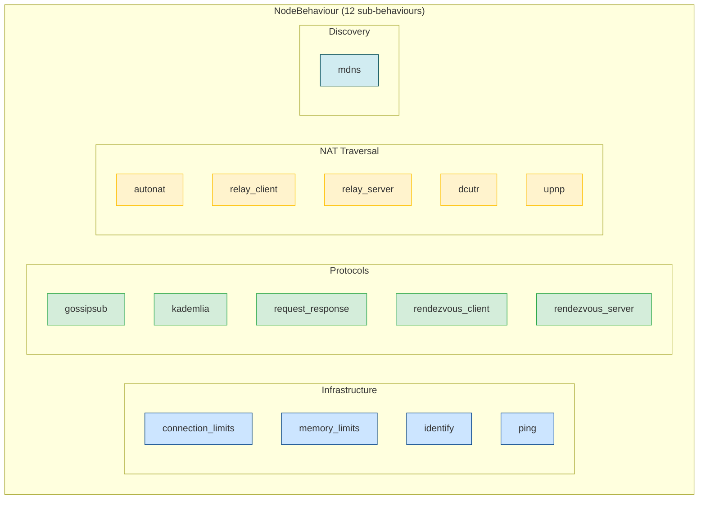
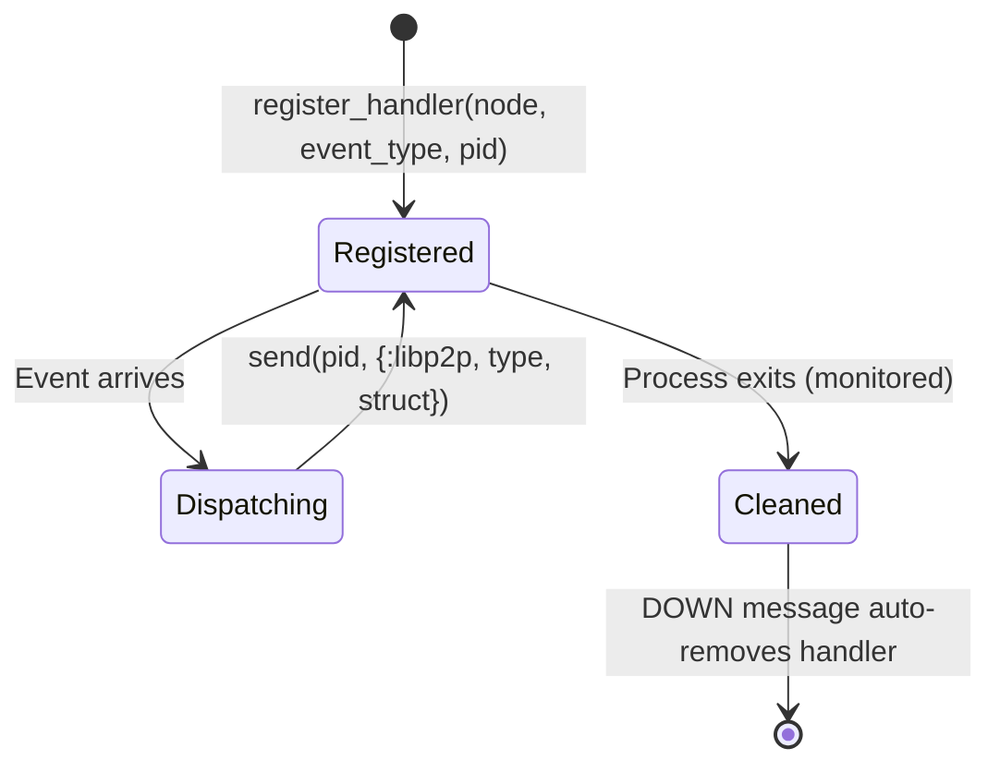
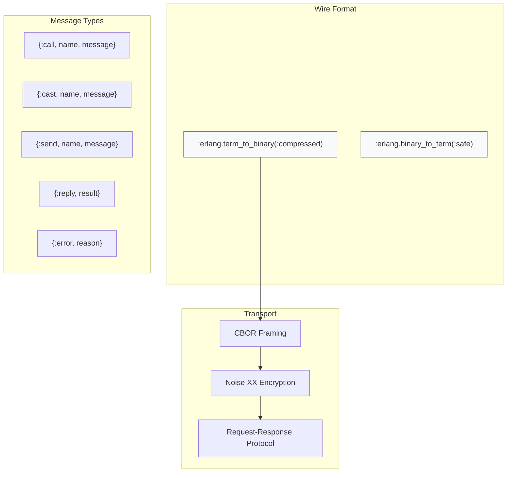
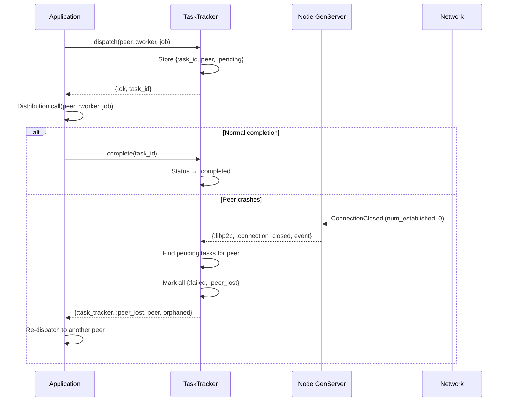
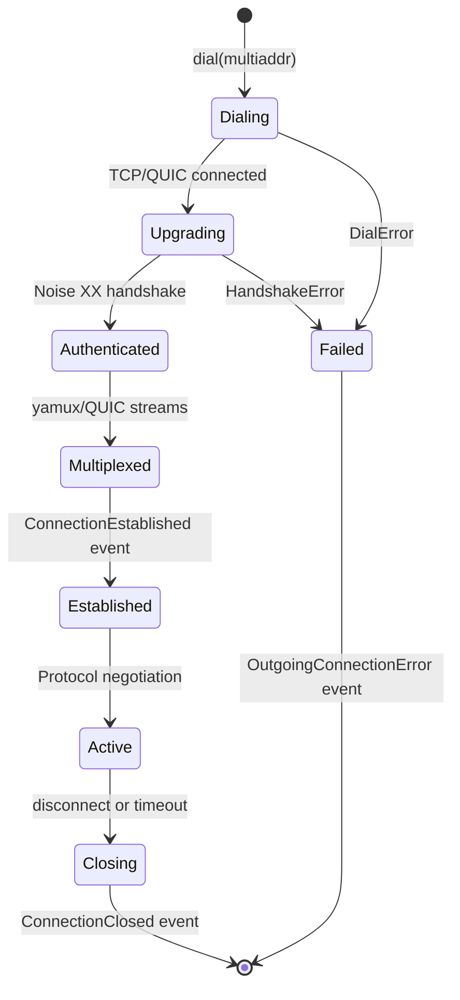
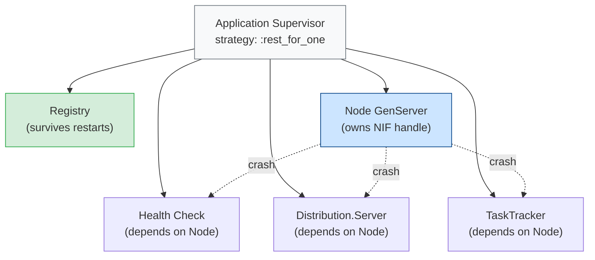

# ExLibp2p Architecture

Deep technical reference for the ExLibp2p architecture — three-layer design,
data flow, NIF boundary, Rust async runtime, event system, supervision,
security model, and failure handling.

## Layer Model



### Why Three Layers

| Layer | Runs on | Responsibility | Failure domain |
|-------|---------|---------------|----------------|
| **Elixir** | BEAM scheduler | API, supervision, event dispatch | OTP restart |
| **NIF Boundary** | BEAM dirty scheduler | Type conversion, scheduler safety | `catch_unwind` |
| **Rust Async** | tokio worker threads (2) | Swarm I/O, protocol state machines | Task panic → logged |

The key constraint: the libp2p `Swarm` is `!Sync` — it cannot be shared across threads.
This forces the command channel pattern: NIFs never touch the Swarm directly.

## Data Flow

### Commands (Elixir → Rust)

```mermaid
sequenceDiagram
    participant App as Application
    participant GS as GenServer
    participant NIF as NIF Function
    participant Chan as mpsc Channel
    participant Loop as Swarm Loop

    App->>GS: GenServer.call publish
    GS->>NIF: native.publish
    Note over NIF: Normal scheduler, under 1ms
    NIF->>Chan: cmd_tx.send Publish command
    NIF-->>GS: ok
    GS-->>App: ok
    Chan->>Loop: tokio select receives command
    Loop->>Loop: gossipsub.publish
```

Fire-and-forget commands (dial, publish, subscribe) return `:ok` immediately.
The NIF enqueues the command and returns — the swarm processes it asynchronously.

### Queries (Elixir → Rust → Elixir)

```mermaid
sequenceDiagram
    participant App as Application
    participant GS as GenServer
    participant NIF as NIF Function
    participant Chan as mpsc and oneshot
    participant Loop as Swarm Loop

    App->>GS: GenServer.call connected_peers
    GS->>NIF: native.connected_peers
    Note over NIF: DirtyCpu scheduler, blocks until reply
    NIF->>Chan: send ConnectedPeers with oneshot
    Chan->>Loop: tokio select receives command
    Loop->>Loop: swarm.connected_peers collect
    Loop->>Chan: oneshot.send peers
    Chan-->>NIF: blocking_recv returns peers
    NIF-->>GS: list of peer ID strings
    GS-->>App: ok with PeerId structs
```

Query commands carry a `oneshot::Sender` for the reply. The NIF blocks on `blocking_recv()`
which is why it runs on a dirty scheduler — never block a normal BEAM scheduler.

### Events (Rust → Elixir)

```mermaid
sequenceDiagram
    participant Net as Network
    participant Loop as Swarm Loop
    participant Env as OwnedEnv
    participant GS as Node GenServer
    participant Handler as Event Handler

    Net->>Loop: SwarmEvent Behaviour
    Loop->>Env: OwnedEnv new
    Env->>Env: Encode event as Elixir term
    Env->>GS: send_and_clear to pid
    Note over Env: Allocates 4KB, released after send
    GS->>GS: handle_info libp2p_event
    GS->>GS: Event.from_raw to struct
    GS->>Handler: send pid libp2p event
```

Events flow from the tokio swarm loop to Elixir via `OwnedEnv::send_and_clear`.
This is the **only safe way** to send from a non-BEAM thread to a BEAM process.
`send_and_clear` MUST NOT be called from a BEAM-managed thread (panics).

## NIF Boundary Design



The `ExLibp2p.Native` behaviour defines the port (hexagonal architecture).
Config swaps the adapter:

| Environment | Module | How |
|-------------|--------|-----|
| Production | `ExLibp2p.Native.Nif` | `config/config.exs` |
| Test | `ExLibp2p.Native.Mock` | `config/test.exs` |
| Integration test | `ExLibp2p.Native.Nif` | `NifCase` helper overrides |

### Scheduler Safety

| Scheduler | NIF duration | Used for |
|-----------|-------------|----------|
| **Normal** | < 1ms | Fire-and-forget: dial, publish, subscribe, stop |
| **DirtyCpu** | 1-100ms | Query: connected_peers, mesh_peers, keypair_from_protobuf |
| **DirtyIo** | 10ms-1s | Start: start_node (creates runtime, binds listeners) |

A NIF that blocks a normal scheduler for > 1ms stalls the entire BEAM scheduler
thread — causing process starvation across the VM.

### Panic Safety



Two layers of panic protection:

1. **`start_node`**: `std::panic::catch_unwind` wraps the entire node construction.
   Panics return `{:error, "NIF panic caught..."}` instead of crashing the BEAM.

2. **Swarm loop**: `FutureExt::catch_unwind` wraps the async event loop.
   If the swarm loop panics, it's logged via `tracing::error!` and the
   task stops — but the BEAM and tokio runtime survive.

Rustler 0.36+ also catches panics by default, but explicit `catch_unwind`
provides defense-in-depth.

## NodeHandle and ResourceArc



The `NodeHandle` stored in `ResourceArc` holds only:
- `cmd_tx`: the sending half of an unbounded mpsc channel
- `peer_id`: cached base58 string (immutable after creation)

The Swarm lives exclusively in the tokio task — never exposed to the NIF.
When `NodeHandle` is dropped (Elixir GC or explicit stop), its `Drop` impl
sends `Command::Shutdown` through the channel to cleanly stop the swarm loop.

## NetworkBehaviour Composition



The `#[derive(NetworkBehaviour)]` macro generates:
- `NodeBehaviourEvent` enum with one variant per sub-behaviour
- Composed `ConnectionHandler` via nested `ConnectionHandlerSelect`
- Delegation of all `NetworkBehaviour` trait methods

### Event Routing

The swarm loop dispatches events by matching the generated enum:

```
SwarmEvent::Behaviour(NodeBehaviourEvent::Gossipsub(...)) → events.rs
SwarmEvent::Behaviour(NodeBehaviourEvent::Kademlia(...))  → events.rs
SwarmEvent::Behaviour(NodeBehaviourEvent::RequestResponse(Message::Request{...}))
    → node.rs (extracts ResponseChannel, stores in HashMap, sends to Elixir)
SwarmEvent::ConnectionEstablished{...} → events.rs
SwarmEvent::ConnectionClosed{...}     → events.rs
```

Request-response inbound requests get special handling: the `ResponseChannel`
is `!Clone` and must be extracted before encoding the event for Elixir.
It's stored in a `HashMap<String, ResponseChannel>` keyed by a monotonic
channel ID (`"ch-1"`, `"ch-2"`, ...).

## Event Handler Lifecycle



Handler is `Process.monitor`'d and stored as `{pid, monitor_ref}`.
No dead PIDs accumulate — zero leak over time.

Each registered handler is `Process.monitor`'d. When the handler process exits,
the `:DOWN` message triggers automatic cleanup — the handler is removed from the
`event_handlers` map and the monitor ref is removed from the `monitors` reverse index.

Re-registering the same PID for the same event type is a no-op (checked via
`List.keymember?`). This prevents duplicate delivery.

## OTP Distribution Protocol



### Security Properties

| Property | Mechanism |
|----------|-----------|
| **Confidentiality** | Noise XX (X25519 + ChaChaPoly) — every connection |
| **Authentication** | PeerId = Ed25519 public key hash, verified in handshake |
| **Integrity** | ChaCha20-Poly1305 AEAD — tamper detection |
| **Atom safety** | `binary_to_term(:safe)` rejects unknown atoms |
| **Open mesh** | Any authenticated peer can call any registered GenServer |

The `:safe` option for `binary_to_term` is critical: without it, a malicious peer
could send terms with new atoms, exhausting the BEAM's atom table (which is never GC'd).
With `:safe`, only atoms that already exist in the VM are accepted.

## Task Tracker and Peer Loss Detection



The TaskTracker only fires `:peer_lost` when `num_established` drops to 0 —
meaning the **last** connection to that peer is gone. If the peer has multiple
connections (e.g., TCP + QUIC), losing one doesn't trigger the notification.

## Connection Lifecycle



### Connection Limits

Three layers of protection:

| Layer | Mechanism | Default |
|-------|-----------|---------|
| **Count limits** | `connection_limits::Behaviour` | 256 in, 256 out, 2 per peer |
| **Memory limits** | `memory_connection_limits::Behaviour` | 90% system memory |
| **Idle timeout** | `SwarmConfig` | 60 seconds |

When limits are reached, new connections are denied — the peer receives a
`ConnectionDenied` error. Existing connections are not affected.

## Supervision Strategy



**`rest_for_one`** means: if the Node crashes, Health, Distribution.Server,
and TaskTracker all restart (they depend on the Node). But the Registry
survives — it was started before Node.

### What Happens on Node Crash

1. BEAM detects the GenServer process exit
2. Supervisor restarts Node (new PID, new NIF handle, new Swarm)
3. Health, Distribution.Server, TaskTracker restart and re-register with new Node
4. **The tokio runtime survives** (`OnceLock<Runtime>` is process-independent)
5. Old swarm loop receives `Command::Shutdown` from `NodeHandle::Drop`
6. New node gets a new PeerId (unless keypair was persisted)

### Tested Recovery

The panic safety test suite verifies:
- BEAM survives invalid NIF inputs
- BEAM survives rapid create/destroy cycles
- BEAM survives concurrent operations during shutdown
- Full functionality (gossipsub, DHT, subscribe) works after crash + restart
- Supervisor auto-restarts node with same registered name

## Rust Crate Architecture

```
native/ex_libp2p_nif/src/
├── lib.rs          NIF entry point, 30+ #[rustler::nif] functions
├── node.rs         NodeHandle, start_node_inner, swarm_loop
├── behaviour.rs    #[derive(NetworkBehaviour)] with 12 sub-behaviours
├── commands.rs     Command enum (all messages from NIF to swarm loop)
├── events.rs       SwarmEvent → Elixir term translation
├── config.rs       NodeConfig parsed from Elixir map
└── atoms.rs        Rust atoms matching Elixir atoms
```

| File | SRP | Changes when... |
|------|-----|-----------------|
| `lib.rs` | NIF function signatures | New NIF function added |
| `node.rs` | Swarm construction + event loop | New command handled, builder changed |
| `behaviour.rs` | Behaviour composition | New protocol added |
| `commands.rs` | Command enum definition | New command type |
| `events.rs` | Event encoding | New event type to send to Elixir |
| `config.rs` | Config parsing | New config field |
| `atoms.rs` | Atom definitions | New atom needed |

Adding a new protocol touches all 7 files — this is inherent to the
NIF boundary pattern, not a design flaw. Each file has a single reason
to change (its own concern), and the changes are mechanical.

## Performance Characteristics

| Operation | Latency | Scheduler |
|-----------|---------|-----------|
| NIF call overhead | ~100-200ns | Normal |
| Command channel send | ~10ns | Normal |
| Oneshot round-trip | ~2-20μs | DirtyCpu |
| `OwnedEnv` allocation | ~4KB | tokio thread |
| Noise XX handshake | ~1-5ms | tokio thread |
| GossipSub publish | ~10-100μs | tokio thread |
| Kademlia lookup | ~100ms-10s | tokio thread (async) |

### Bottleneck Analysis

The Node GenServer is a single process — all API calls are serialized through it.
This is intentional (single writer to the NIF handle), but under extreme load
(>10K calls/second), the GenServer mailbox can back up.

Mitigations:
- `peer_id` is cached in `NodeHandle` — no channel round-trip
- Fire-and-forget commands return immediately
- `connected_peer_count` could use `Arc<AtomicUsize>` for lock-free reads
- For read-heavy workloads, cache state in ETS

## rust-libp2p Coverage

Every protocol and feature in rust-libp2p v0.54 is wrapped:

### Transports

| Feature | Cargo.toml | Rust Behaviour | Elixir API | Notes |
|---------|:---:|:---:|:---:|-------|
| TCP | Yes | SwarmBuilder | Config | Noise XX + yamux, nodelay enabled |
| QUIC | Yes | SwarmBuilder | Config | Built-in TLS 1.3 + mux, 1-RTT |
| DNS | Yes | SwarmBuilder | Config | Resolves DNS in multiaddrs |
| WebSocket | Yes | SwarmBuilder | Config | `enable_websocket` flag |

### Security

| Feature | Cargo.toml | Elixir API | Notes |
|---------|:---:|:---:|-------|
| Noise XX | Yes | Automatic | X25519 + ChaChaPoly + SHA256 |
| TLS 1.3 | Yes | Automatic | Used by QUIC |
| Private Networks (pnet) | Yes | Config | Pre-shared key support |
| Ed25519 keys | Yes | `Keypair` | Default key type |
| secp256k1 keys | Yes | Available | Feature enabled |
| ECDSA keys | Yes | Available | Feature enabled |
| RSA keys | Yes | Available | Feature enabled |

### Protocols

| Feature | Cargo.toml | Rust Behaviour | Elixir Module | Notes |
|---------|:---:|:---:|:---:|-------|
| GossipSub v1.1 | Yes | `gossipsub::Behaviour` | `Gossipsub` | Peer scoring, content-addressed IDs |
| Kademlia DHT | Yes | `kad::Behaviour` | `DHT` | Client/server auto-detect |
| Request-Response | Yes | `request_response::cbor::Behaviour` | `RequestResponse` | Full ResponseChannel storage |
| Identify | Yes | `identify::Behaviour` | Automatic | Required for DHT + NAT |
| Ping | Yes | `ping::Behaviour` | Automatic | Liveness checks |
| Rendezvous Client | Yes | `rendezvous::client::Behaviour` | `Rendezvous` | Namespace discovery |
| Rendezvous Server | Yes | `rendezvous::server::Behaviour` | Config | Serves registrations |
| mDNS | Yes | `mdns::tokio::Behaviour` | `Discovery` | Local network discovery |

### NAT Traversal

| Feature | Cargo.toml | Rust Behaviour | Elixir Module | Notes |
|---------|:---:|:---:|:---:|-------|
| AutoNAT | Yes | `autonat::Behaviour` | Events | Detects Public/Private/Unknown |
| Relay Client | Yes | `relay::client::Behaviour` | `Relay` | Via `SwarmBuilder::with_relay_client` |
| Relay Server | Yes | `relay::Behaviour` | Config | Serves relay for other peers |
| DCUtR | Yes | `dcutr::Behaviour` | Events | Hole punching (~70% success) |
| UPnP | Yes | `upnp::tokio::Behaviour` | Events | Auto port mapping |

### Resource Management

| Feature | Cargo.toml | Rust Behaviour | Elixir API | Notes |
|---------|:---:|:---:|:---:|-------|
| Connection Limits | Yes | `connection_limits::Behaviour` | Config | Per-peer, in/out, pending |
| Memory Limits | Yes | `memory_connection_limits::Behaviour` | Automatic | Rejects at 90% system memory |
| Bandwidth Metrics | Yes | `SwarmBuilder::with_bandwidth_metrics` | `Metrics` | bytes_in / bytes_out |
| CBOR codec | Yes | Via request-response | Automatic | Default RPC codec |
| JSON codec | Yes | Available | Config | Alternative RPC codec |

### Not Included (intentionally)

| Feature | Why |
|---------|-----|
| floodsub | Deprecated — GossipSub replaces it |
| plaintext | Insecure — test-only, never for production |
| async-std | We use tokio exclusively |
| uds | Unix domain sockets — niche use case |
| wasm-bindgen | Browser WASM only |
| websocket-websys | Browser WASM only |
| webtransport-websys | Browser WASM only |

## Use Case Examples

### 1. Chat Application — GossipSub Pub/Sub

The most common use case: multiple nodes exchange messages via topic-based pub/sub.

```elixir
defmodule MyChat do
  use GenServer

  def start_link(opts) do
    GenServer.start_link(__MODULE__, opts, name: __MODULE__)
  end

  def send_message(text), do: GenServer.cast(__MODULE__, {:send, text})

  @impl true
  def init(_opts) do
    {:ok, node} = ExLibp2p.Node.start_link(
      listen_addrs: ["/ip4/0.0.0.0/tcp/0"],
      gossipsub_topics: ["chat"],
      enable_mdns: true  # auto-discover peers on local network
    )

    # Register to receive messages and peer events
    ExLibp2p.Gossipsub.register_handler(node)
    ExLibp2p.Discovery.register_handler(node)

    {:ok, peer_id} = ExLibp2p.Node.peer_id(node)
    IO.puts("Chat started as #{peer_id}")

    {:ok, %{node: node}}
  end

  @impl true
  def handle_cast({:send, text}, state) do
    {:ok, peer_id} = ExLibp2p.Node.peer_id(state.node)
    payload = Jason.encode!(%{from: to_string(peer_id), text: text})
    ExLibp2p.Gossipsub.publish(state.node, "chat", payload)
    {:noreply, state}
  end

  @impl true
  def handle_info({:libp2p, :gossipsub_message, msg}, state) do
    case Jason.decode(msg.data) do
      {:ok, %{"from" => from, "text" => text}} ->
        IO.puts("[#{String.slice(from, 0..7)}] #{text}")
      _ -> :ok
    end
    {:noreply, state}
  end

  def handle_info({:libp2p, :peer_discovered, event}, state) do
    IO.puts("Discovered peer: #{event.peer_id}")
    {:noreply, state}
  end

  def handle_info({:libp2p, :connection_established, event}, state) do
    IO.puts("Connected to: #{event.peer_id}")
    {:noreply, state}
  end
end
```

### 2. Distributed Task Processing — RPC + Task Tracking

Dispatch work to remote peers, track completion, handle peer failures.

```elixir
defmodule MyWorkerPool do
  use GenServer

  def start_link(opts), do: GenServer.start_link(__MODULE__, opts, name: __MODULE__)
  def dispatch(job), do: GenServer.call(__MODULE__, {:dispatch, job})

  @impl true
  def init(_opts) do
    {:ok, node} = ExLibp2p.Node.start_link(
      listen_addrs: ["/ip4/0.0.0.0/tcp/0"],
      enable_mdns: true
    )

    # Serve inbound RPC calls (so remote peers can call our workers)
    {:ok, _} = ExLibp2p.OTP.Distribution.Server.start_link(node: node)

    # Track outbound work for peer-loss detection
    {:ok, tracker} = ExLibp2p.OTP.TaskTracker.start_link(node: node)
    ExLibp2p.OTP.TaskTracker.subscribe(tracker)

    # Register for response events (needed for Distribution.call)
    ExLibp2p.RequestResponse.register_handler(node)

    # Discover workers
    ExLibp2p.Discovery.register_handler(node)

    {:ok, %{node: node, tracker: tracker, workers: []}}
  end

  @impl true
  def handle_call({:dispatch, job}, _from, state) do
    case state.workers do
      [] ->
        {:reply, {:error, :no_workers}, state}

      [worker | rest] ->
        # Track the task
        {:ok, task_id} = ExLibp2p.OTP.TaskTracker.dispatch(
          state.tracker, worker, :worker, job
        )

        # Call the remote worker (5 second timeout)
        case ExLibp2p.OTP.Distribution.call(state.node, worker, :worker, job, 5_000) do
          {:ok, result} ->
            ExLibp2p.OTP.TaskTracker.complete(state.tracker, task_id)
            # Rotate workers (simple round-robin)
            {:reply, {:ok, result}, %{state | workers: rest ++ [worker]}}

          {:error, reason} ->
            ExLibp2p.OTP.TaskTracker.fail(state.tracker, task_id, reason)
            {:reply, {:error, reason}, state}
        end
    end
  end

  @impl true
  def handle_info({:libp2p, :peer_discovered, event}, state) do
    {:noreply, %{state | workers: [event.peer_id | state.workers]}}
  end

  def handle_info({:task_tracker, :peer_lost, _peer_id, orphaned}, state) do
    IO.puts("Worker lost! #{length(orphaned)} tasks need re-dispatch")
    # Re-dispatch orphaned tasks to other workers
    for task <- orphaned, do: dispatch(task.message)
    {:noreply, state}
  end
end
```

### 3. Persistent Identity Node — Keypair + NAT Traversal

Production node with stable identity across restarts and NAT traversal.

```elixir
defmodule MyP2PNode do
  use Supervisor

  @identity_file "priv/identity.key"

  def start_link(opts) do
    Supervisor.start_link(__MODULE__, opts, name: __MODULE__)
  end

  @impl true
  def init(opts) do
    # Load or generate a persistent keypair for stable PeerId
    keypair = load_or_generate_keypair()
    IO.puts("Node identity: #{keypair.peer_id}")

    bootstrap_peers = Keyword.get(opts, :bootstrap_peers, [])

    children = [
      # Core node with NAT traversal enabled
      {ExLibp2p.Node,
       name: :p2p,
       keypair_bytes: keypair.protobuf_bytes,
       listen_addrs: ["/ip4/0.0.0.0/tcp/4001", "/ip4/0.0.0.0/udp/4001/quic-v1"],
       enable_mdns: true,
       enable_relay: true,
       enable_autonat: true,
       enable_upnp: true,
       gossipsub_topics: ["my-app/v1"],
       bootstrap_peers: bootstrap_peers},

      # Health monitoring with telemetry
      {ExLibp2p.Health, node: :p2p, interval: 30_000},

      # Serve inbound OTP calls from remote peers
      {ExLibp2p.OTP.Distribution.Server, node: :p2p},

      # Track dispatched work
      {ExLibp2p.OTP.TaskTracker, node: :p2p, name: :task_tracker}
    ]

    # rest_for_one: if Node crashes, everything after it restarts
    Supervisor.init(children, strategy: :rest_for_one)
  end

  defp load_or_generate_keypair do
    case ExLibp2p.Keypair.load(@identity_file) do
      {:ok, keypair} ->
        keypair

      {:error, :file_not_found} ->
        {:ok, keypair} = ExLibp2p.Keypair.generate()
        File.mkdir_p!(Path.dirname(@identity_file))
        :ok = ExLibp2p.Keypair.save!(keypair, @identity_file)
        keypair
    end
  end
end
```

## Test Coverage

### Summary

| Category | Test Count | What's Verified |
|----------|:---:|-----------------|
| **Unit tests (mock NIF)** | 163 | Every public function, config validation, event parsing, handler lifecycle |
| **Doctests** | 14 | PeerId, Multiaddr, Config examples |
| **Integration (real NIF)** | 34 | Every function end-to-end with actual libp2p |
| **Connectivity** | 8 | Join, leave, dynamic churn, connection events |
| **GossipSub** | 8 | Subscribe, publish, 3-node mesh, mesh_peers, peer_score |
| **mDNS Discovery** | 3 | Auto-discovery, late joiner, departure detection |
| **DHT** | 4 | put/get records, find_peer, provide/find_providers, bootstrap |
| **Request-Response** | 3 | send_request, inbound with channel_id, full round-trip |
| **Keypair** | 6 | Generate, protobuf round-trip, save/load, stable identity |
| **Security** | 11 | Connection limits, flooding, crashes, concurrency, identity |
| **Capacity** | 4 | 10-node star, 10-node gossipsub, 20-node mesh, node departure |
| **Stress** | 3 | 100-node mesh, structured messaging, churn under load |
| **Soak** | 1 | 50 cycles: leak detection with linear regression |
| **Panic Safety** | 7 | Invalid inputs, rapid cycles, shutdown races, crash recovery, supervisor restart |

### Per-Module Test Coverage

| Module | Unit Tests | Integration Tests | Covered Functions |
|--------|:---:|:---:|---|
| `Node` | 18 | 8 | start/stop, peer_id, connected_peers, listening_addrs, dial, subscribe, publish, register/unregister_handler, dead handler cleanup |
| `PeerId` | 10 | — | new, new!, to_string, inspect, equality, Jason.Encoder |
| `Multiaddr` | 9 | — | new, new!, to_string, inspect, with_p2p, Jason.Encoder |
| `Config` | 8 | — | new/0, new/1, validate, defaults, limits, unknown keys |
| `Event` | 8 | — | from_raw for all 7 event types + unknown |
| `Gossipsub` | 5 | 4 | subscribe, unsubscribe, publish, register_handler, mesh_peers, all_peers, peer_score |
| `DHT` | 7 | 4 | put_record, get_record, find_peer, provide, find_providers, bootstrap, register_handler |
| `RequestResponse` | 4 | 3 | send_request, send_response, register_handler, inbound dispatch |
| `Discovery` | 3 | 2 | register_handler, bootstrap (with peers), bootstrap (empty) |
| `Keypair` | 8 | 6 | generate, to_protobuf, from_protobuf, save!, load, load!, permissions, stable identity |
| `Relay` | 2 | 2 | listen_via_relay, register_handler |
| `Rendezvous` | 4 | 2 | register, discover, unregister, register_handler |
| `Metrics` | 1 | 2 | bandwidth |
| `Health` | 2 | — | start_link, check |
| `Telemetry` | 5 | — | event_names, all event categories present |
| `OTP.Distribution` | 6 | — | call, cast, send, encode/decode, handle_remote_request |
| `OTP.Distribution.Server` | 3 | — | inbound dispatch, nonexistent process, invalid data |
| `OTP.TaskTracker` | 12 | — | dispatch, complete, fail, get, pending_for_peer, all_pending, subscribe, peer_lost notification, cleanup |

### Soak Test Results (50 cycles)

Each cycle: 100 gossipsub messages, 10 RPCs, 2 DHT ops, 5 graceful departures,
2 simulated crashes (`Process.exit(:kill)`), 5 new nodes via mDNS.

| Metric | Result | Threshold | Verdict |
|--------|--------|-----------|---------|
| Final memory vs baseline | 0.98x | < 1.2x | No growth |
| Memory slope (cycles 26-50) | 0.005%/cycle | < 0.5% | 100x under limit |
| Process slope (cycles 26-50) | 0.0/cycle | < 1.0 | Zero growth |
| Binary memory slope | 0.008%/cycle | < 1.0% | 125x under limit |

### Security Test Coverage

| Attack Vector | Test | Assertion |
|--------------|------|-----------|
| Connection exhaustion | 10 nodes → target with max 3 | At most 3 connected |
| Per-peer eclipse | Single peer, max 1 per peer | Only 1 connection |
| Message flooding | 1000 rapid messages | Node stays responsive |
| Invalid payloads | Empty, oversized, malformed | No crash, error returned |
| Identity spoofing | 20 nodes | All unique Ed25519 IDs |
| 50% mass failure | Kill 10 of 20 nodes | Survivors maintain connectivity |
| Handler crash | Exception in event handler | Node auto-cleans dead handler |
| Connect/disconnect churn | 20 rapid cycles | No process leak |
| Concurrent API access | 50 tasks × 10 calls | No state corruption |
| Invalid multiaddr injection | 7 malicious strings | All rejected safely |
| Rust panic survival | Bad config, garbage data, shutdown race | BEAM alive, functionality recovers |
