# ExLibp2p Design Decisions

A comprehensive reference for the architecture, design decisions, trade-offs,
and solutions in the ExLibp2p project -- an Elixir wrapper for rust-libp2p
using Rustler NIFs.

---

## Table of Contents

1. [Introduction and Project Goals](#1-introduction-and-project-goals)
2. [The Three-Layer Architecture](#2-the-three-layer-architecture)
3. [The NIF Boundary](#3-the-nif-boundary)
4. [Command Channel Architecture](#4-command-channel-architecture)
5. [Event Bridging](#5-event-bridging)
6. [NetworkBehaviour Composition](#6-networkbehaviour-composition)
7. [OTP Integration](#7-otp-integration)
8. [Configuration Design](#8-configuration-design)
9. [Testing Strategy](#9-testing-strategy)
10. [Remaining Issues and Future Work](#10-remaining-issues-and-future-work)
11. [Alternative: Mesh Overlay Networks](#11-alternative-mesh-overlay-networks)

---

## 1. Introduction and Project Goals

### 1.1 The Problem Space

Peer-to-peer networking in the BEAM ecosystem has historically been limited
to Distributed Erlang, which assumes trusted networks, uses unencrypted
connections by default, and relies on DNS/epmd for node discovery. For
applications that need to operate in hostile, heterogeneous, or internet-scale
environments -- decentralized applications, mesh networks, content-addressed
storage, real-time collaboration -- a fundamentally different networking stack
is required.

libp2p is a modular, protocol-agnostic networking framework originally
developed for IPFS. It provides:

- **Transport agnosticism**: TCP, QUIC, WebSocket, WebTransport
- **Encrypted connections**: Noise XX (X25519 + ChaChaPoly) or TLS 1.3
- **Protocol negotiation**: multistream-select for runtime protocol matching
- **Peer identity**: Ed25519 public-key-derived identifiers
- **Pub/Sub messaging**: GossipSub with peer scoring and mesh optimization
- **Distributed hash table**: Kademlia for content routing and peer discovery
- **NAT traversal**: Circuit Relay v2, DCUtR hole punching, AutoNAT, UPnP
- **Peer discovery**: mDNS (local), DHT (global), Rendezvous (targeted)

### 1.2 Why Wrap rust-libp2p?

The decision to wrap rust-libp2p rather than implement libp2p natively in
Elixir or use an alternative approach was driven by several factors:

**Prior art analysis:**

| Approach | Project | Status | Limitations |
|----------|---------|--------|-------------|
| Erlang native | helium/erlang-libp2p | Archived | Tight coupling to Helium consensus, limited protocol support, no GossipSub |
| Go daemon + IPC | libp2p/go-libp2p-daemon | Archived | Separate process, gRPC overhead, deployment complexity, no OTP integration |
| JavaScript | js-libp2p | Active | Browser-focused, Node.js runtime overhead, no BEAM integration |
| Rust NIF | **ExLibp2p (this project)** | Active | NIF safety constraints (addressed in this document) |
| Pure Elixir | (none) | N/A | Would require implementing ~20 protocols from scratch |

**Why not a pure Elixir implementation?**

A pure Elixir libp2p implementation would need to implement:

1. Noise XX handshake protocol (X25519 key exchange, ChaChaPoly AEAD)
2. Yamux multiplexer (connection multiplexing, flow control, keep-alive)
3. GossipSub v1.1 (mesh management, scoring, message caching, IHAVE/IWANT)
4. Kademlia DHT (routing table, iterative lookups, record storage/replication)
5. multistream-select (protocol negotiation)
6. Identify protocol (peer metadata exchange)
7. Circuit Relay v2 (reservation system, relay protocol)
8. DCUtR (direct connection upgrade through relay)
9. AutoNAT (NAT detection via probing)
10. Request-Response (substream-per-request RPC)

Each of these is a complex protocol with subtle correctness requirements.
The GossipSub specification alone is 30+ pages. rust-libp2p has been in
development since 2019 with hundreds of contributors and is battle-tested
in production networks (Substrate/Polkadot, Filecoin, Forest, Lighthouse).
Reimplementing this in Elixir would take years and produce a less tested
result.

**Why Rust specifically?**

| Language | FFI Mechanism | Latency | Memory Safety | Ecosystem |
|----------|--------------|---------|---------------|-----------|
| C | Port driver or NIF | Lowest | Manual | libp2p not available |
| Go | CGo + Port | High (runtime overhead) | GC pauses | go-libp2p exists but daemon approach adds IPC |
| Rust | Rustler NIF | Low (~100ns call overhead) | Compile-time guarantees | rust-libp2p is the most complete implementation |
| C++ | NIF | Low | Manual + RAII | No libp2p implementation |

Rust's ownership system provides memory safety without a garbage collector,
making it uniquely suited for NIF integration. A Rust NIF cannot produce
use-after-free, double-free, or data races at compile time -- the same class
of bugs that make C NIFs dangerous to the BEAM VM.

### 1.3 Design Philosophy

ExLibp2p follows a clear separation of concerns:

> **Elixir for what it is best at**: OTP supervision, process management,
> API design, event routing, configuration validation, testing.
>
> **Rust for what it is best at**: networking, cryptography, protocol
> implementation, memory-safe concurrency, performance-critical paths.

This philosophy manifests in concrete decisions throughout the codebase:

- The Elixir side owns all process lifecycle (GenServer, supervision trees)
- The Rust side owns all network I/O (Swarm, transports, protocols)
- The NIF boundary is a thin translation layer, not a business logic layer
- Configuration flows Elixir -> Rust (never the reverse)
- Events flow Rust -> Elixir (via message passing, not callbacks)

```mermaid
graph LR
    subgraph "Elixir (BEAM)"
        A[Application Code] --> B[ExLibp2p Facade]
        B --> C[Context Modules]
        C --> D[Node GenServer]
        D --> E[Native Behaviour]
    end

    subgraph "NIF Boundary"
        E --> F[ExLibp2p.Native.Nif]
        F --> G[Rustler Translation]
    end

    subgraph "Rust (tokio)"
        G --> H[Command Channel]
        H --> I[Swarm Event Loop]
        I --> J[NetworkBehaviour]
    end

    I -.->|OwnedEnv::send_and_clear| D

    style A fill:#9b59b6,color:#fff
    style B fill:#9b59b6,color:#fff
    style C fill:#9b59b6,color:#fff
    style D fill:#9b59b6,color:#fff
    style E fill:#9b59b6,color:#fff
    style F fill:#e67e22,color:#fff
    style G fill:#e67e22,color:#fff
    style H fill:#e74c3c,color:#fff
    style I fill:#e74c3c,color:#fff
    style J fill:#e74c3c,color:#fff
```

### 1.4 Module Census

The project comprises 24 Elixir modules and 7 Rust source files.
Line counts are approximate and may drift as code evolves:

**Elixir modules (24):**

| Module | Role | Lines (approx) |
|--------|------|-------|
| `ExLibp2p` | Facade, convenience delegates | ~80 |
| `ExLibp2p.Node` | Central GenServer, owns NIF handle | ~410 |
| `ExLibp2p.Native` | @callback behaviour definition | ~62 |
| `ExLibp2p.Native.Nif` | Production NIF implementation | ~142 |
| `ExLibp2p.Native.Mock` | Test mock implementation | ~115 |
| `ExLibp2p.Node.Config` | Configuration struct + validation | ~180 |
| `ExLibp2p.Node.Event` | 13 event structs + parser | ~284 |
| `ExLibp2p.Gossipsub` | GossipSub context module | ~74 |
| `ExLibp2p.Gossipsub.PeerScore` | Scoring configuration | ~115 |
| `ExLibp2p.DHT` | Kademlia DHT context module | ~68 |
| `ExLibp2p.Discovery` | Peer discovery context module | ~51 |
| `ExLibp2p.RequestResponse` | Request-response RPC | ~65 |
| `ExLibp2p.Relay` | Circuit Relay v2 context module | ~62 |
| `ExLibp2p.Rendezvous` | Rendezvous discovery | ~70 |
| `ExLibp2p.Health` | Periodic health monitoring | ~102 |
| `ExLibp2p.Metrics` | Bandwidth statistics | ~28 |
| `ExLibp2p.Telemetry` | 9 telemetry event definitions | ~55 |
| `ExLibp2p.PeerId` | Base58-validated peer identifier | ~86 |
| `ExLibp2p.Multiaddr` | Protocol-aware multiaddress | ~108 |
| `ExLibp2p.Keypair` | Ed25519 keypair management | ~130 |
| `ExLibp2p.OTP.Distribution` | Transparent GenServer.call over libp2p | ~197 |
| `ExLibp2p.OTP.Distribution.Server` | Inbound request dispatcher | ~74 |
| `ExLibp2p.OTP.TaskTracker` | Distributed task tracking | ~239 |
| `ExLibp2p.Application` | OTP application entry point | ~11 |

**Rust source files (7):**

| File | Role | Lines (approx) |
|------|------|-------|
| `lib.rs` | 30+ NIF function definitions | ~367 |
| `node.rs` | Runtime, SwarmBuilder, event loop | ~483 |
| `commands.rs` | 18 Command enum variants | ~99 |
| `events.rs` | SwarmEvent to Elixir term encoding | ~398 |
| `behaviour.rs` | Composed NetworkBehaviour (15 sub-behaviours) | ~44 |
| `config.rs` | NodeConfig parsed from Elixir HashMap | ~161 |
| `atoms.rs` | 46 Rustler atom definitions | ~47 |

Total Rust: ~1,599 lines across 7 files.

---

## 2. The Three-Layer Architecture

### 2.1 Why Three Layers Instead of Two?

A naive NIF design would have two layers: Elixir calls Rust functions
directly. ExLibp2p uses three distinct layers because the NIF boundary
itself is a first-class architectural concern with unique constraints.

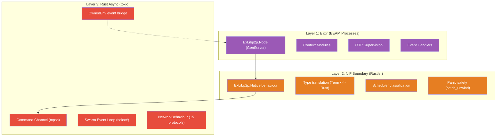

Each layer has distinct responsibilities:

| Concern | Layer 1 (Elixir) | Layer 2 (NIF Boundary) | Layer 3 (Rust Async) |
|---------|-----------------|----------------------|---------------------|
| Process management | GenServer lifecycle | N/A | N/A |
| Concurrency model | BEAM processes | Scheduler safety | tokio tasks |
| Error representation | `{:ok, _} \| {:error, _}` | Atom/String translation | `Result<T, E>` |
| State ownership | GenServer state | ResourceArc | Swarm + HashMap |
| Failure isolation | Process crash | catch_unwind | AssertUnwindSafe |
| Data format | Elixir terms | Term encoding/decoding | Rust types |
| Configuration | Config struct | HashMap<String, Term> | NodeConfig |

### 2.2 The Key Constraint: Swarm is !Sync

The entire three-layer architecture is forced by a single Rust trait bound:

```rust
// libp2p::Swarm does NOT implement Sync
// This means it CANNOT be shared across threads safely
impl !Sync for Swarm<B> where B: NetworkBehaviour {}
```

This has profound implications:

1. **The Swarm cannot be stored in a ResourceArc** -- Rustler's `ResourceArc`
   is `Arc<T>` under the hood, which requires `T: Send + Sync`. Swarm is
   `Send` (can be moved to another thread) but NOT `Sync` (cannot be
   accessed from multiple threads simultaneously).

2. **NIF functions cannot call Swarm methods directly** -- NIF functions run
   on BEAM scheduler threads. Multiple NIF calls can execute concurrently on
   different schedulers. If they accessed the Swarm directly, that would
   require `Sync`.

3. **The Swarm must live on exactly one thread** -- and all access must be
   serialized through that thread.

This constraint forces the command channel pattern: NIF functions send
`Command` enums through an `mpsc` channel to a dedicated tokio task that
owns the Swarm exclusively.

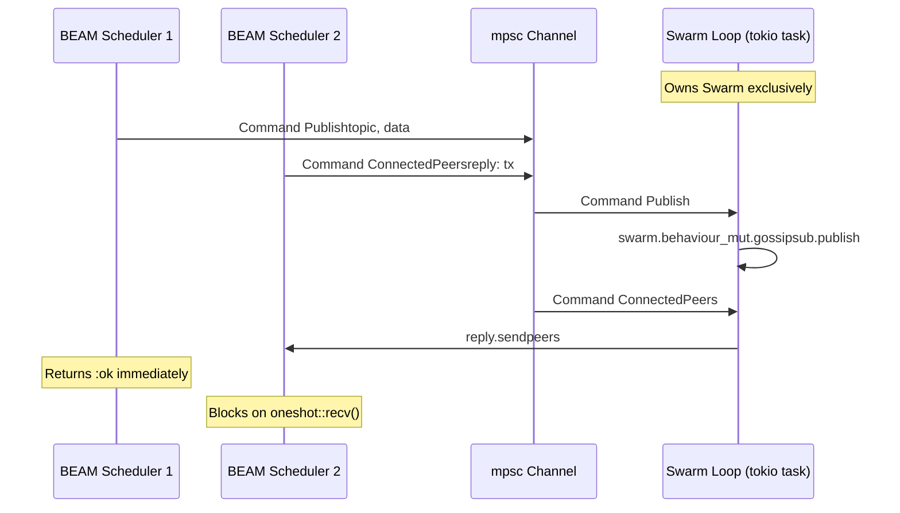

### 2.3 Alternative Approaches Considered

#### 2.3.1 Port-Based Architecture (Separate OS Process)

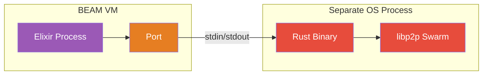

**Pros:**
- Complete fault isolation (Rust crash cannot crash the BEAM)
- No scheduler safety concerns
- Simpler Rust code (no Rustler, no NIF constraints)

**Cons:**
- IPC serialization overhead on every call (~10-100us per message)
- Cannot share BEAM references (ResourceArc impossible)
- Two processes to deploy, monitor, and keep alive
- Startup latency (process spawn + initialization)
- No direct access to BEAM scheduler infrastructure

**Decision:** Rejected. The IPC overhead is unacceptable for high-frequency
operations like GossipSub message delivery (potentially thousands per second).
The NIF approach provides ~100ns call overhead vs ~10-100us for port I/O.

#### 2.3.2 Direct NIF Access to Swarm (No Command Channel)


**Pros:**
- Simpler architecture (no channel, no command enum)
- Lowest possible latency

**Cons:**
- **Impossible.** `Swarm` is `!Sync`, making `ResourceArc<Swarm>` a
  compile error.
- Even if it were `Sync`, concurrent Swarm access would cause protocol
  state corruption.

**Decision:** Rejected. Rust's type system prevents this at compile time.

#### 2.3.3 Go Daemon with gRPC

**Pros:**
- go-libp2p is mature and well-tested
- gRPC provides typed RPC interface

**Cons:**
- Go runtime overhead (~10MB base memory for goroutine scheduler)
- Separate daemon process (deployment complexity)
- gRPC serialization on every call
- No OTP integration (supervision, monitoring, etc.)
- go-libp2p-daemon project is archived

**Decision:** Rejected. Same IPC problems as the port approach, plus the Go
runtime adds overhead and deployment complexity.

#### 2.3.4 Pure Elixir Implementation

**Pros:**
- No FFI complexity
- Full BEAM integration
- Easier debugging (no cross-language stack traces)

**Cons:**
- Would require implementing ~20 complex protocols from scratch
- Years of development effort for a single developer/team
- Less battle-tested than rust-libp2p (used in production by Substrate,
  Filecoin, Forest, Lighthouse, etc.)
- Performance limitations for crypto operations (Noise handshake, signing)

**Decision:** Rejected. The development effort is disproportionate to the
benefit. rust-libp2p represents hundreds of person-years of work.

### 2.4 Decision Matrix: Architecture Choice

| Criterion | Weight | Port | Direct NIF | Go Daemon | Pure Elixir | **NIF + Channel** |
|-----------|--------|------|-----------|-----------|-------------|-------------------|
| Call latency | 5 | 2 | 5 | 1 | 5 | 4 |
| Fault isolation | 4 | 5 | 1 | 5 | 5 | 3 |
| Deployment simplicity | 3 | 2 | 5 | 1 | 5 | 5 |
| OTP integration | 5 | 3 | 5 | 1 | 5 | 5 |
| Memory safety | 5 | 4 | 5 | 4 | 5 | 4 |
| Development effort | 4 | 3 | N/A | 3 | 1 | 4 |
| Protocol completeness | 5 | 4 | N/A | 4 | 1 | 5 |
| Feasibility | 5 | 5 | 0 | 5 | 5 | 5 |
| **Weighted Total** | | **127** | **N/A** | **104** | **128** | ****158**** |

*Scores: 0-5. Direct NIF gets 0 for Feasibility (Swarm is !Sync) and N/A for effort/completeness (impossible to implement). Rust NIFs have full memory safety (5) — Rust's ownership system prevents the bugs that make C NIFs dangerous.*

### 2.5 Data Flow: Elixir to Rust

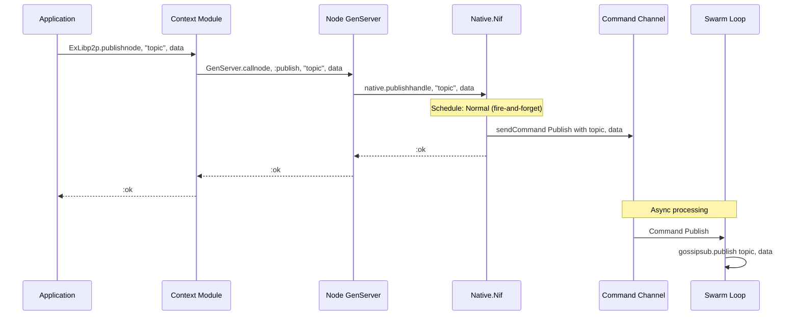

### 2.6 Data Flow: Rust to Elixir

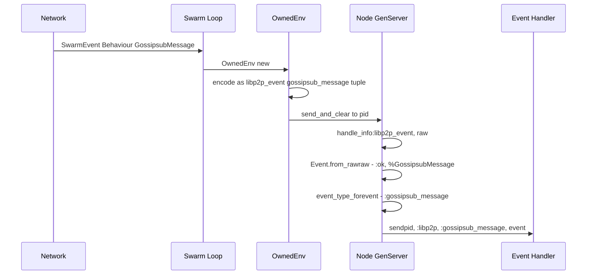

### 2.7 Layer Boundaries and Failure Domains

Each layer has its own failure domain:

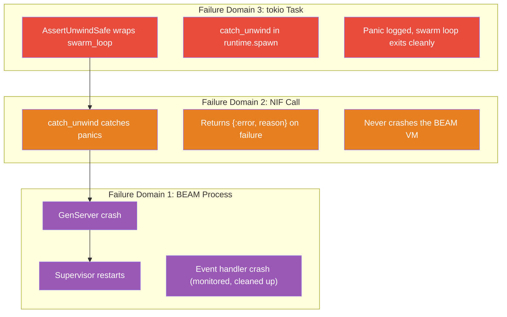

A panic in the Swarm loop:
1. Is caught by `AssertUnwindSafe` + `catch_unwind` in the spawned task
2. Logs the panic via `tracing::error!`
3. The swarm loop exits, closing the `cmd_rx` end of the channel
4. Future NIF calls return `None` from `rx.blocking_recv()`, which maps
   to `Vec::default()` or `(atoms::error(), 0, 0)` etc.
5. The GenServer continues running but returns empty/error results
6. When the GenServer terminates, the `Drop` impl on `NodeHandle` sends
   `Command::Shutdown` (which is ignored since the loop already exited)

No BEAM crash. No undefined behavior. Clean degradation.

---

## 3. The NIF Boundary

### 3.1 Hexagonal Architecture with @callback Behaviour

The NIF boundary uses a hexagonal (ports-and-adapters) pattern. The
`ExLibp2p.Native` module defines a `@callback` behaviour that specifies
the complete NIF interface:

```elixir
defmodule ExLibp2p.Native do
  @typedoc "Opaque handle to a native libp2p node."
  @type handle :: reference()

  # --- Node lifecycle ---
  @callback start_node(map()) :: {:ok, handle()} | {:error, term()}
  @callback stop_node(handle()) :: :ok
  @callback register_event_handler(handle(), pid()) :: :ok
  @callback get_peer_id(handle()) :: String.t()
  @callback connected_peers(handle()) :: [String.t()]
  @callback listening_addrs(handle()) :: [String.t()]
  @callback dial(handle(), String.t()) :: :ok | {:error, atom()}

  # ... 20+ more callbacks
end
```

Two implementations exist:

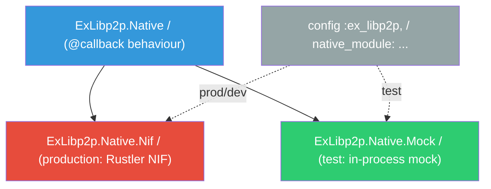

The Node GenServer reads the module at initialization:

```elixir
# In ExLibp2p.Node

@default_native Application.compile_env(:ex_libp2p, :native_module, ExLibp2p.Native.Nif)

def init(opts) do
  native = Keyword.get(opts, :native_module, @default_native)
  # ...
  {:ok, handle} <- native.start_node(config_map)
  # All subsequent calls go through state.native
end
```

### 3.2 Why Config-Driven Module Swapping (Not Mox Directly)?

ExLibp2p uses config-driven module swapping rather than Mox for the primary
test/production switch:

| Approach | Mechanism | When Binding Happens | Test Isolation |
|----------|-----------|---------------------|----------------|
| **Config-driven** | `Application.compile_env` | Compile time (with runtime override) | Per-module (via `native_module:` option) |
| Mox | `Mox.defmock` + `expect` | Runtime (per-test setup) | Per-test (via allowances) |
| Module attribute | `@native_module` | Compile time only | None (global) |

**Why config-driven?**

1. **Compile-time default**: `config/test.exs` sets `native_module: Mock`,
   so unit tests never attempt Rust compilation. This is critical for CI
   speed -- the Rust NIF takes 60-90 seconds to compile.

2. **Per-test override**: Integration tests override with
   `native_module: ExLibp2p.Native.Nif` in `start_test_node/1`:

   ```elixir
   # test/support/nif_case.ex
   def start_test_node(opts \\ []) do
     defaults = [
       listen_addrs: ["/ip4/127.0.0.1/tcp/0"],
       enable_mdns: false,
       idle_connection_timeout_secs: 30
     ]
     merged = Keyword.merge(defaults, opts)
     ExLibp2p.Node.start_link(Keyword.put(merged, :native_module, ExLibp2p.Native.Nif))
   end
   ```

3. **No Mox ceremony**: The Mock module returns sensible defaults without
   requiring `expect` setup in every test. Tests that need specific mock
   behavior can still use Mox on top of this.

4. **Integration test clarity**: When an integration test fails, it fails
   because the real NIF has a problem -- not because of mock configuration.

### 3.3 The Atom vs String Key Problem

A subtle but important boundary design decision concerns how Elixir maps
are passed to Rust. Elixir maps with atom keys (the idiomatic form) cause
problems at the NIF boundary:

```elixir
# Elixir side: atom keys are natural
config = %{listen_addrs: ["/ip4/0.0.0.0/tcp/0"], enable_mdns: true}

# But Rustler decodes this as HashMap<Atom, Term>, not HashMap<String, Term>
# Atom is an opaque type in Rustler -- you can't pattern-match on it easily
```

ExLibp2p solves this by converting atom keys to strings before crossing the
NIF boundary:

```elixir
# In ExLibp2p.Node.init/1
config_map = valid_config |> Map.from_struct() |> stringify_keys()

defp stringify_keys(map) do
  Map.new(map, fn {k, v} -> {to_string(k), v} end)
end
```

On the Rust side, `config.rs` uses `HashMap<String, Term>` and provides
typed getter functions:

```rust
pub fn from_map(
    map: &std::collections::HashMap<String, rustler::Term>,
) -> Result<Self, String> {
    Ok(Self {
        keypair_bytes: get_binary(map, "keypair_bytes"),
        listen_addrs: get_string_list(map, "listen_addrs")?,
        gossipsub_mesh_n: get_usize(map, "gossipsub_mesh_n", 6),
        enable_mdns: get_bool(map, "enable_mdns", true),
        // ...
    })
}
```

**Why not use Rustler's `Deserialize` derive macro?**

The `#[derive(NifStruct)]` or `#[derive(NifMap)]` macros could auto-derive
the config, but they have limitations:

1. They require exact field-name matching between Elixir and Rust
2. They do not support default values for missing keys
3. They produce opaque decode errors instead of descriptive error messages
4. Optional fields (`Option<Vec<u8>>` for `keypair_bytes`) need special
   handling for Elixir's `nil` atom

The manual `get_*` helper approach gives precise control over defaults,
error messages, and nil handling.

### 3.4 Scheduler Safety: The 1ms Rule

BEAM schedulers are cooperative. A NIF function that blocks a scheduler
for more than 1ms degrades the BEAM's ability to schedule other processes.
Rustler provides three scheduler annotations:

| Schedule | Use When | BEAM Impact | ExLibp2p Usage |
|----------|----------|-------------|----------------|
| `Normal` | Function completes in <1ms | None | Fire-and-forget commands (publish, subscribe, dial) |
| `DirtyCpu` | CPU-bound work >1ms | Uses dirty CPU scheduler pool | Synchronous queries (connected_peers, mesh_peers) |
| `DirtyIo` | I/O-bound work (blocking) | Uses dirty I/O scheduler pool | Node startup (blocks on SwarmBuilder) |

**Classification rationale:**

- `start_node` uses `DirtyIo` because `SwarmBuilder` performs DNS resolution,
  socket binding, and mDNS initialization -- all of which involve system calls
  that may block.

- `connected_peers`, `listening_addrs`, `gossipsub_mesh_peers` etc. use
  `DirtyCpu` because they send a command through the channel and then
  `blocking_recv()` on a oneshot -- this is a synchronous wait that could
  take microseconds to milliseconds depending on Swarm load.

- `publish`, `subscribe`, `dial` etc. use `Normal` because they only push
  a command into an unbounded channel, which is an atomic operation that
  takes nanoseconds.

```rust
// Fire-and-forget: push to channel, return immediately
#[rustler::nif]  // Normal scheduler
fn publish(handle: ResourceArc<NodeHandle>, topic: String, data: Binary) -> rustler::Atom {
    let bytes = data.as_slice().to_vec();
    let _ = send_cmd(&handle, Command::Publish { topic, data: bytes });
    atoms::ok()
}

// Query: push + wait for response
#[rustler::nif(schedule = "DirtyCpu")]
fn connected_peers(handle: ResourceArc<NodeHandle>) -> Vec<String> {
    query(&handle, |tx| Command::ConnectedPeers { reply: tx })
        .map(peer_ids_to_strings)
        .unwrap_or_default()
}

// Startup: heavy I/O (sockets, DNS, mDNS init)
#[rustler::nif(schedule = "DirtyIo")]
fn start_node(config: HashMap<String, Term>) -> Result<ResourceArc<NodeHandle>, ...> {
    // ...
}
```

### 3.5 Return Type Discipline: The Double-Wrapping Trap

A common NIF design mistake is double-wrapping return values. Consider:

```rust
// BAD: Returns Result<Atom, ...> which becomes {:ok, :ok} or {:error, ...}
#[rustler::nif]
fn bad_publish(...) -> Result<rustler::Atom, (rustler::Atom, String)> {
    // ...
    Ok(atoms::ok())  // Elixir sees: {:ok, :ok}  -- double-wrapped!
}

// GOOD: Returns Atom directly -- Elixir sees :ok
#[rustler::nif]
fn publish(...) -> rustler::Atom {
    // ...
    atoms::ok()  // Elixir sees: :ok
}
```

Rustler automatically wraps `Result<T, E>` in `{:ok, T}` or `{:error, E}`.
If the NIF returns `Result<Atom, _>` with `Ok(:ok)`, Elixir receives
`{:ok, :ok}` instead of the desired `:ok`.

ExLibp2p follows a consistent pattern:

- **Fire-and-forget operations** return `rustler::Atom` directly (`:ok` or `:error`)
- **Query operations** return the data type directly (e.g., `Vec<String>`, `(Atom, Vec<String>)`)
- **Startup** returns `Result<ResourceArc<NodeHandle>, (Atom, String)>` -- the one
  case where `Result` is appropriate because the GenServer needs `{:ok, handle}` or
  `{:error, reason}` to decide whether to start

The GenServer wraps fire-and-forget results when it wants to add context:

```elixir
# NIF returns :ok or :error (bare atom)
# GenServer passes it through directly
def handle_call({:publish, topic, data}, _from, state) do
  result = state.native.publish(state.handle, topic, data)
  {:reply, result, state}
end

# NIF returns Vec<String> (bare list)
# GenServer wraps it in {:ok, _}
def handle_call(:connected_peers, _from, state) do
  peers = Enum.map(state.native.connected_peers(state.handle), &PeerId.new!/1)
  {:reply, {:ok, peers}, state}
end
```

### 3.6 Binary Data: Vec<u8> vs NewBinary vs OwnedBinary

Three approaches exist for passing binary data across the NIF boundary:

| Type | Direction | Allocation | Copy? | Use Case |
|------|-----------|-----------|-------|----------|
| `Binary<'a>` | Elixir -> Rust | BEAM heap | Read-only view (zero-copy) | Input data (publish, DHT put) |
| `NewBinary` | Rust -> Elixir | BEAM heap (pre-allocated) | One copy (into BEAM binary) | Return values with known size |
| `OwnedBinary` | Rust -> Elixir | Rust heap, then released to BEAM | One copy (alloc + fill), then release | Event data (unknown when env is created) |

ExLibp2p uses all three:

```rust
// Binary<'a> for input: zero-copy read of Elixir binary
#[rustler::nif]
fn publish(handle: ResourceArc<NodeHandle>, topic: String, data: Binary) -> rustler::Atom {
    let bytes = data.as_slice().to_vec(); // Copy into Vec<u8> for channel send
    let _ = send_cmd(&handle, Command::Publish { topic, data: bytes });
    atoms::ok()
}

// NewBinary for known-size output (keypair generation)
fn make_binary<'a>(env: rustler::Env<'a>, data: &[u8]) -> rustler::Binary<'a> {
    let mut bin = rustler::NewBinary::new(env, data.len());
    bin.as_mut_slice().copy_from_slice(data);
    bin.into()
}

// OwnedBinary for event data (allocated in OwnedEnv context)
fn encode_binary<'a>(env: Env<'a>, data: &[u8]) -> Term<'a> {
    let mut bin = rustler::OwnedBinary::new(data.len()).expect("binary allocation");
    bin.as_mut_slice().copy_from_slice(data);
    bin.release(env).encode(env)
}
```

Note the important distinction: `Binary<'a>` borrows the BEAM's binary with
zero copies, but has a lifetime tied to the current NIF call. `Vec<u8>` is
needed when the data must outlive the NIF call (e.g., sent through the
command channel to the Swarm loop). The `data.as_slice().to_vec()` copy is
unavoidable for channel-sent data.

### 3.7 Panic Safety

A panic in a NIF function would normally abort the BEAM VM. ExLibp2p
provides multiple layers of panic protection:

**Layer 1: `catch_unwind` in `start_node`**

```rust
#[rustler::nif(schedule = "DirtyIo")]
fn start_node(config: HashMap<String, Term>) -> Result<ResourceArc<NodeHandle>, ...> {
    match std::panic::catch_unwind(std::panic::AssertUnwindSafe(|| {
        node::start_node_inner(config)
    })) {
        Ok(Ok(handle)) => Ok(handle),
        Ok(Err(e)) => Err((atoms::error(), e)),
        Err(_) => Err((
            atoms::error(),
            "NIF panic caught in start_node -- check Rust logs".to_string(),
        )),
    }
}
```

**Layer 2: `catch_unwind` on the Swarm loop task**

```rust
runtime.spawn(async move {
    let result = std::panic::AssertUnwindSafe(swarm_loop(swarm, cmd_rx))
        .catch_unwind()
        .await;

    if let Err(e) = result {
        tracing::error!("swarm loop panicked: {e:?}");
    }
});
```

**Layer 3: Rustler's built-in panic catching**

Rustler wraps all NIF calls in its own panic handler. Even without explicit
`catch_unwind`, a panic would be caught by Rustler and converted to an
Erlang exception (not a VM crash).

**Layer 4: Graceful degradation on channel closure**

If the Swarm loop panics and exits, the `cmd_rx` receiver is dropped.
Subsequent `cmd_tx.send()` calls return `Err`, which is handled:

```rust
fn query<T>(handle: &ResourceArc<NodeHandle>, make_cmd: ...) -> Option<T> {
    let (tx, rx) = oneshot::channel();
    handle.cmd_tx.send(make_cmd(tx)).ok()?; // Returns None if channel closed
    rx.blocking_recv().ok()                   // Returns None if sender dropped
}
```

The NIF functions then return safe defaults:

```rust
fn connected_peers(handle: ResourceArc<NodeHandle>) -> Vec<String> {
    query(&handle, |tx| Command::ConnectedPeers { reply: tx })
        .map(peer_ids_to_strings)
        .unwrap_or_default() // Returns empty Vec on failure
}
```

### 3.8 The #[rustler::resource_impl] Requirement

Rustler 0.36+ requires an explicit `#[rustler::resource_impl]` annotation
for types stored in `ResourceArc`. Without it, Rustler cannot register the
resource type with the BEAM runtime, and `ResourceArc::new()` will fail at
runtime with an opaque error:

```rust
pub struct NodeHandle {
    pub cmd_tx: mpsc::UnboundedSender<Command>,
    pub peer_id: String,
}

// Required for ResourceArc<NodeHandle> to work
#[rustler::resource_impl]
impl rustler::Resource for NodeHandle {}
```

This was a breaking change from Rustler 0.35, which used a
`resource!` macro. The new approach is more explicit and discoverable.

### 3.9 Runtime.enter() for Async-Dependent Construction

`SwarmBuilder::with_tokio()`, mDNS (netlink sockets), and QUIC (quinn)
all require an active tokio reactor context during construction. Since
`start_node_inner` runs on a BEAM dirty scheduler (not inside a tokio
task), the runtime context must be explicitly entered:

```rust
pub fn start_node_inner(config_map: HashMap<String, Term>) -> Result<...> {
    let runtime = get_runtime();

    // Enter the tokio runtime context -- required by SwarmBuilder::with_tokio(),
    // mDNS (netlink sockets), and QUIC (quinn).
    let _guard = runtime.enter();

    // Now SwarmBuilder can use tokio's reactor
    let mut swarm = libp2p::SwarmBuilder::with_existing_identity(keypair)
        .with_tokio()
        // ...
        .build();
}
```

Without `runtime.enter()`, `SwarmBuilder::with_tokio()` panics with
"there is no reactor running". The `_guard` is a `EnterGuard` that
removes the runtime context when dropped (at the end of the function).

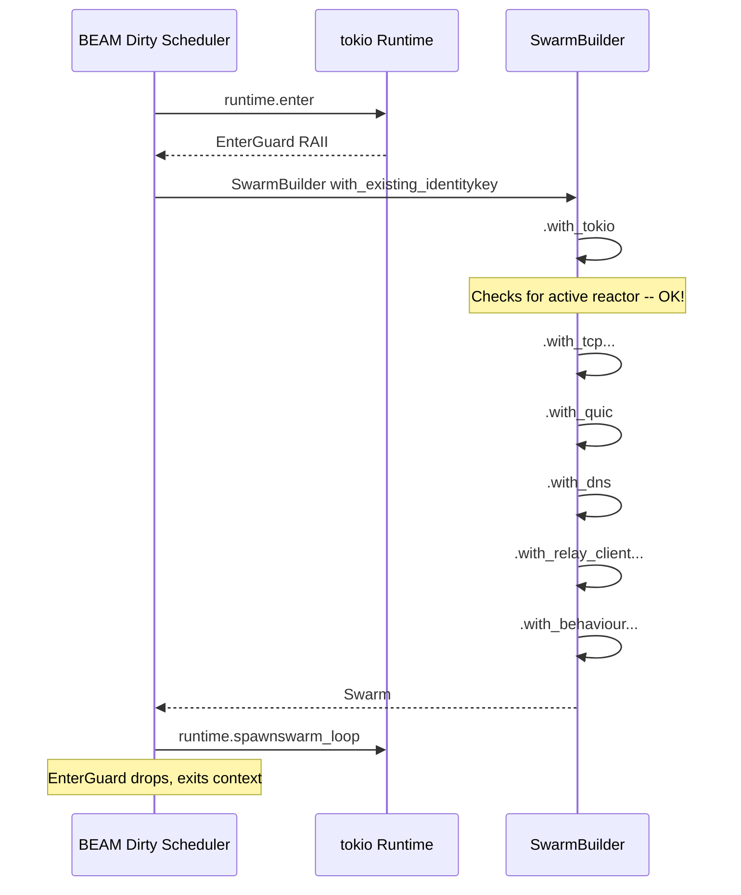

---

## 4. Command Channel Architecture

### 4.1 Why Unbounded mpsc?

The command channel uses `tokio::sync::mpsc::unbounded_channel()`. This
was a deliberate choice:

| Channel Type | Backpressure | Behavior When Full | Use Case |
|-------------|-------------|-------------------|----------|
| `bounded(N)` | Yes | `send()` blocks or returns `TrySendError::Full` | High-volume producers that need flow control |
| `unbounded()` | No | Never blocks, unbounded growth | Low-volume commands from NIF |
| `broadcast` | No | All receivers get every message | Pub/sub (not command dispatch) |

**Why unbounded?**

1. **NIF calls cannot block on Normal schedulers.** If a bounded channel
   is full, `send()` would need to be `async` (requiring a tokio context)
   or `try_send()` would return an error that the fire-and-forget NIF
   cannot meaningfully handle.

2. **Command volume is bounded by GenServer throughput.** The GenServer
   processes one message at a time. Even under extreme load, the GenServer's
   mailbox is the bottleneck, not the command channel. The channel acts as
   a thin bridge, not a buffer.

3. **Commands are small.** A `Command::Publish` holds a `String` + `Vec<u8>`.
   Even with 10,000 pending commands, memory usage is manageable.

**Backpressure analysis:**


The natural backpressure point is the GenServer mailbox. If callers are
sending faster than the Swarm can process:

1. GenServer.call replies pile up -> callers block on `receive`
2. Eventually callers hit the GenServer.call timeout (default 5s)
3. Callers get `{:error, :timeout}` -> they back off

This is the standard OTP backpressure mechanism. Adding channel-level
backpressure would create a second, redundant pressure point with the
added complexity of bridging `async` backpressure to `sync` NIF calls.

### 4.2 Command Enum Design

The `Command` enum has 24 variants organized into two categories:

```rust
pub enum Command {
    // --- Fire-and-forget (no reply) ---
    Dial { addr: Multiaddr },
    Publish { topic: String, data: Vec<u8> },
    Subscribe { topic: String },
    Unsubscribe { topic: String },
    RegisterEventHandler { pid: rustler::LocalPid },
    DhtPut { key: Vec<u8>, value: Vec<u8> },
    DhtGet { key: Vec<u8> },
    DhtFindPeer { peer_id: PeerId },
    DhtProvide { key: Vec<u8> },
    DhtFindProviders { key: Vec<u8> },
    DhtBootstrap,
    ListenViaRelay { relay_addr: Multiaddr },
    RendezvousRegister { namespace: String, ttl: u64, rendezvous_peer: PeerId },
    RendezvousDiscover { namespace: String, rendezvous_peer: PeerId },
    RendezvousUnregister { namespace: String, rendezvous_peer: PeerId },
    Shutdown,

    // --- Queries (reply via oneshot) ---
    ConnectedPeers { reply: oneshot::Sender<Vec<PeerId>> },
    ListeningAddrs { reply: oneshot::Sender<Vec<Multiaddr>> },
    BandwidthStats { reply: oneshot::Sender<(u64, u64)> },
    GossipsubMeshPeers { topic: String, reply: oneshot::Sender<Vec<PeerId>> },
    GossipsubAllPeers { reply: oneshot::Sender<Vec<PeerId>> },
    GossipsubPeerScore { peer_id: PeerId, reply: oneshot::Sender<Option<f64>> },
    RpcSendRequest { peer_id: PeerId, data: Vec<u8>, reply: oneshot::Sender<String> },
    RpcSendResponse { channel_id: String, data: Vec<u8> },
}
```

### 4.3 Fire-and-Forget vs Query Patterns

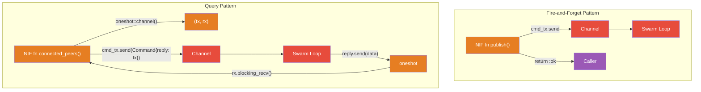

The generic `query` helper encapsulates the oneshot pattern:

```rust
/// Sends a query command with a oneshot reply channel and blocks for the response.
/// Returns `None` if the node is stopped or the channel is dropped.
fn query<T>(
    handle: &ResourceArc<NodeHandle>,
    make_cmd: impl FnOnce(oneshot::Sender<T>) -> Command,
) -> Option<T> {
    let (tx, rx) = oneshot::channel();
    handle.cmd_tx.send(make_cmd(tx)).ok()?;
    rx.blocking_recv().ok()
}
```

This helper is called by all query NIFs:

```rust
#[rustler::nif(schedule = "DirtyCpu")]
fn connected_peers(handle: ResourceArc<NodeHandle>) -> Vec<String> {
    query(&handle, |tx| Command::ConnectedPeers { reply: tx })
        .map(peer_ids_to_strings)
        .unwrap_or_default()
}
```

Note the `schedule = "DirtyCpu"` annotation -- `blocking_recv()` blocks the
calling thread until the Swarm loop responds, which could take microseconds
to milliseconds. This must not happen on a normal BEAM scheduler.

### 4.4 The ResponseChannel Problem

libp2p's request-response protocol has a fundamental type constraint:
`ResponseChannel<T>` is `!Clone` and consumed on use. Once you call
`send_response(channel, data)`, the channel is gone. This creates a
problem at the NIF boundary:

1. An inbound request arrives with a `ResponseChannel`
2. The event must be encoded and sent to Elixir
3. Elixir processes the request and calls `rpc_send_response` with the response
4. The Rust side needs the original `ResponseChannel` to send the response

But the `ResponseChannel` cannot be encoded into an Elixir term (it is a
Rust-only type), cannot be stored in a `ResourceArc` (it is `!Sync`), and
cannot be cloned.

**Solution: Channel ID HashMap**

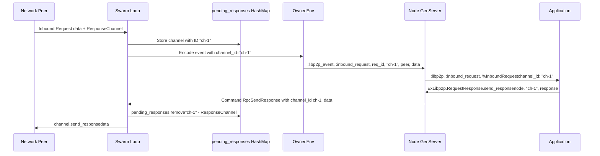

Implementation in the Swarm loop:

```rust
// State variables in swarm_loop
let mut pending_responses: HashMap<String, request_response::ResponseChannel<Vec<u8>>> =
    HashMap::new();
let mut channel_counter: u64 = 0;

// When inbound request arrives:
channel_counter += 1;
let channel_id = format!("ch-{channel_counter}");
pending_responses.insert(channel_id.clone(), channel);
// Send event to Elixir with channel_id

// When Elixir calls send_response:
Some(Command::RpcSendResponse { channel_id, data }) => {
    match pending_responses.remove(&channel_id) {
        Some(channel) => {
            swarm.behaviour_mut().request_response.send_response(channel, data);
        }
        None => {
            tracing::warn!(%channel_id, "unknown channel ID (expired or already used)");
        }
    }
}
```

The channel ID is a monotonically incrementing string (`"ch-1"`, `"ch-2"`, ...).
This is simpler and safer than using a UUID or hash. The counter is local to
the Swarm loop task, so there is no contention.

**Why not use a `u64` channel ID?**

Strings are easier to debug in logs and pass through the NIF boundary without
type conversion issues. The performance difference between a string and a u64
for HashMap lookup is negligible at the expected volume of concurrent requests.

### 4.5 Shutdown Semantics via Drop

The `NodeHandle` struct implements `Drop` to ensure clean shutdown:

```rust
impl Drop for NodeHandle {
    fn drop(&mut self) {
        let _ = self.cmd_tx.send(Command::Shutdown);
    }
}
```

This provides shutdown in two scenarios:

1. **Explicit stop**: `ExLibp2p.Native.Nif.stop_node(handle)` sends
   `Command::Shutdown` directly
2. **Handle dropped**: When the `ResourceArc<NodeHandle>` is garbage
   collected (GenServer terminates, handle goes out of scope), the `Drop`
   impl sends `Command::Shutdown`

The Swarm loop handles both cases identically:

```rust
Some(Command::Shutdown) | None => break,
```

`None` from `cmd_rx.recv()` means the sender was dropped (all senders
closed), which happens when the `NodeHandle` is dropped. This is
semantically equivalent to an explicit shutdown.

```mermaid
stateDiagram-v2
    [*] --> Running : start_node_inner() spawns swarm_loop
    Running --> Running : Process commands
    Running --> ShuttingDown : Command::Shutdown received
    Running --> ShuttingDown : cmd_rx.recv() returns None (handle dropped)
    ShuttingDown --> [*] : swarm_loop exits, Swarm dropped

```

**Running** processes commands and events via `tokio::select!`.
**ShuttingDown** breaks the loop; the Swarm is dropped and all connections close.

### 4.6 The `send_cmd` Helper Pattern

All fire-and-forget NIF functions use a shared helper:

```rust
fn send_cmd(
    handle: &ResourceArc<NodeHandle>,
    cmd: Command,
) -> Result<(), (rustler::Atom, rustler::Atom)> {
    handle
        .cmd_tx
        .send(cmd)
        .map_err(|_| (atoms::error(), atoms::node_stopped()))
}
```

This helper converts the `mpsc::SendError` (which occurs when the receiver
is dropped, i.e., the Swarm loop has exited) into a Rustler-compatible error
tuple. Most callers ignore the error with `let _ = send_cmd(...)` because
fire-and-forget operations have no way to report errors back to the caller
anyway.

---

## 5. Event Bridging

### 5.1 OwnedEnv::send_and_clear -- The Only Safe Way

The core challenge of event bridging is: how does a tokio task (running on
an OS thread managed by tokio's executor) send a message to a BEAM process
(running on a BEAM scheduler thread)?

BEAM has strict rules about process communication:

- `env.send()` can only be called from the thread that currently owns the
  Env (a BEAM scheduler thread)
- NIF functions run on scheduler threads and can use `env.send()`
- tokio tasks run on tokio worker threads -- they are NOT scheduler threads
- Calling `env.send()` from a non-scheduler thread is undefined behavior

Rustler provides `OwnedEnv` to solve this:

```rust
let mut owned_env = OwnedEnv::new();
let _ = owned_env.send_and_clear(&pid, |env| {
    // Build the term using this temporary env
    (atoms::libp2p_event(), (...)).encode(env)
});
```

`OwnedEnv::send_and_clear`:
1. Creates a new, thread-local BEAM environment
2. Calls the closure to build a term in that environment
3. Sends the term to the target PID via an internal BEAM API that is
   safe to call from any OS thread
4. Clears the environment (frees memory)

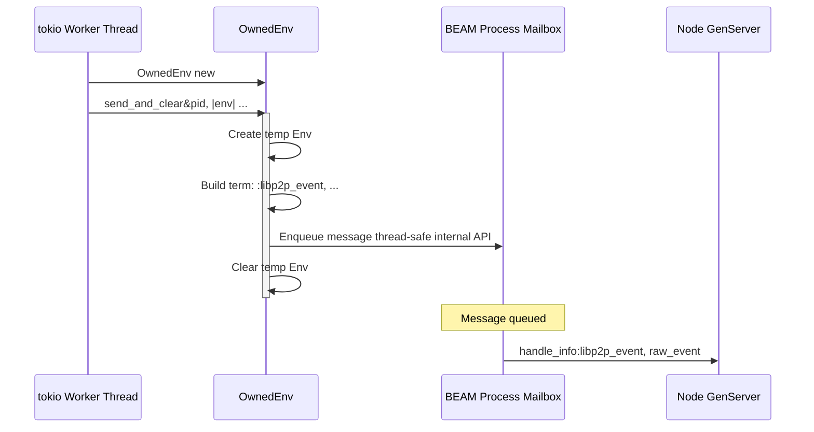

### 5.2 Why Not env.send()?

A tempting but incorrect approach would be to capture the `Env` from the
NIF call that registered the event handler:

```rust
// WRONG: env has a lifetime tied to the NIF call
fn register_event_handler(env: Env, handle: ResourceArc<NodeHandle>, pid: LocalPid) {
    // env cannot be stored -- it is borrowed from the BEAM scheduler
    // and will be invalid after this NIF call returns
    handle.stored_env = env; // Compile error: lifetime issue
}
```

Even if the lifetime issue were circumvented (e.g., via unsafe code),
calling `env.send()` from a tokio thread would cause undefined behavior:

- The env's scheduler thread may be running a different process
- The env's heap may have been garbage collected
- The process associated with the env may have exited

`OwnedEnv` avoids all of these issues by creating an independent, self-contained
environment that does not borrow from any scheduler.

### 5.3 Event Encoding: Tuples

Events are encoded as tagged tuples rather than structs or maps:

```rust
// Encoded as {:libp2p_event, {:connection_established, peer_id, num, endpoint}}
(
    atoms::libp2p_event(),
    (
        atoms::connection_established(),
        peer_id.to_base58(),
        num_established.get(),
        endpoint_atom,
    ),
)
    .encode(env)
```

**Why tuples instead of maps?**

| Format | Encoding Cost | Pattern Matching | Extensibility |
|--------|--------------|-----------------|---------------|
| Tuples | Cheapest (linear encode) | Positional (fragile) | Must add to end |
| Maps | Medium (hash + encode) | Key-based (robust) | Additive-compatible |
| Structs | Most expensive (map + __struct__) | Key-based + type check | Additive-compatible |

Tuples were chosen because:

1. **Performance**: Event encoding happens on the hot path (every network
   event). Tuple encoding is a simple linear write vs. hash-map construction.
2. **Simplicity**: The Rust side does not need to know about Elixir struct
   metadata (the `__struct__` key, module atoms, etc.).
3. **Parsing point**: The `Event.from_raw/1` function on the Elixir side
   is the single parsing point that converts raw tuples into typed structs:

   ```elixir
   def from_raw({:connection_established, peer_id_str, num_established, endpoint}) do
     {:ok, %ConnectionEstablished{
       peer_id: PeerId.new!(peer_id_str),
       num_established: num_established,
       endpoint: endpoint
     }}
   end
   ```

4. **Version boundary**: Adding new fields to the tuple requires updating
   both sides, but this is a compile-time check (the pattern match in
   `from_raw/1` will fail if the tuple shape changes).

### 5.4 Binary Data in Events

Event data that contains binary content (GossipSub messages, DHT records,
request-response payloads) uses `OwnedBinary`:

```rust
fn encode_binary<'a>(env: Env<'a>, data: &[u8]) -> Term<'a> {
    let mut bin = rustler::OwnedBinary::new(data.len()).expect("binary allocation");
    bin.as_mut_slice().copy_from_slice(data);
    bin.release(env).encode(env)
}
```

The flow is:
1. Allocate a Rust-owned binary buffer (`OwnedBinary::new`)
2. Copy the data into it
3. Release ownership to the BEAM (`bin.release(env)`) -- this transfers
   the memory to the BEAM's binary heap
4. Encode the released binary as a term

After `release()`, the binary is owned by the BEAM and will be garbage
collected when no longer referenced by any process.

### 5.5 Event Parsing on the Elixir Side

The `ExLibp2p.Node.Event` module defines 13 event structs and a multi-clause
`from_raw/1` parser:

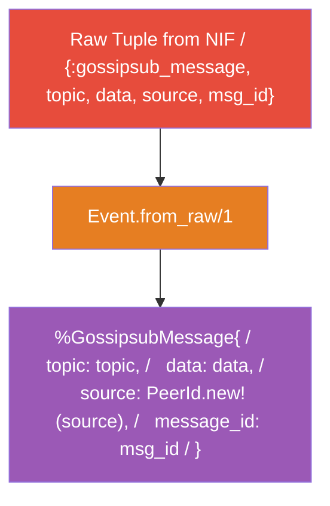

The parser handles 13 event types:

```elixir
def from_raw({:connection_established, peer_id_str, num, endpoint}), do: ...
def from_raw({:connection_closed, peer_id_str, num, cause}), do: ...
def from_raw({:new_listen_addr, address, listener_id}), do: ...
def from_raw({:gossipsub_message, topic, data, source, msg_id}), do: ...
def from_raw({:peer_discovered, peer_id_str, addresses}), do: ...
def from_raw({:dht_query_result, query_id, result}), do: ...
def from_raw({:inbound_request, req_id, ch_id, peer_str, data}), do: ...
def from_raw({:outbound_response, req_id, peer_str, data}), do: ...
def from_raw({:nat_status_changed, status, address}), do: ...
def from_raw({:relay_reservation_accepted, relay_peer_str, addr}), do: ...
def from_raw({:hole_punch_outcome, peer_str, result}), do: ...
def from_raw({:external_addr_confirmed, address}), do: ...
def from_raw({:dial_failure, peer_str, error}), do: ...
def from_raw(_), do: {:error, :unknown_event}
```

Each clause:
1. Pattern-matches the tuple shape (catches mismatches at compile time)
2. Validates/converts peer IDs via `PeerId.new!/1`
3. Wraps in a typed struct for downstream pattern matching

### 5.6 Event Handler Registration and Lifecycle

The Node GenServer maintains a registry of event handlers:

```elixir
defstruct [
  :handle, :peer_id, :native,
  event_handlers: %{},  # %{event_type => [{pid, monitor_ref}]}
  monitors: %{}          # %{monitor_ref => {pid, event_type}} (reverse index)
]
```

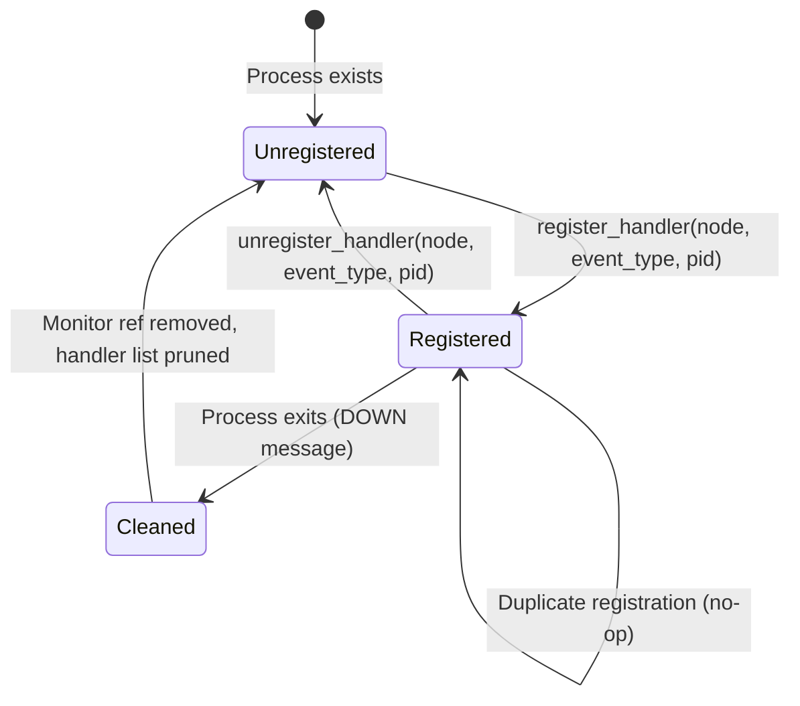

**Registered**: Process is monitored; events dispatched via `send/2`.
**Cleaned**: Automatic cleanup — no dead PIDs accumulate.

Registration workflow:

```elixir
def handle_call({:register_handler, event_type, pid}, _from, state) do
  case already_registered?(state, event_type, pid) do
    true -> {:reply, :ok, state}      # Idempotent
    false ->
      ref = Process.monitor(pid)       # Monitor for cleanup
      handlers = Map.update(state.event_handlers, event_type, [{pid, ref}], ...)
      monitors = Map.put(state.monitors, ref, {pid, event_type})
      {:reply, :ok, %{state | event_handlers: handlers, monitors: monitors}}
  end
end
```

Automatic cleanup on handler death:

```elixir
def handle_info({:DOWN, ref, :process, dead_pid, _reason}, state) do
  case Map.pop(state.monitors, ref) do
    {{^dead_pid, event_type}, monitors} ->
      handlers = Map.update(state.event_handlers, event_type, [], ...)
      {:noreply, %{state | event_handlers: handlers, monitors: monitors}}
    {nil, _} -> {:noreply, state}
  end
end
```

This prevents a common memory leak: if an event handler process crashes or
exits, the GenServer automatically removes it from the handler registry and
demonitors it. Without this cleanup, dead PIDs would accumulate and
`send/2` would silently discard messages.

### 5.7 Event Dispatch

Event dispatch is simple: for each registered handler of the matching type,
send the typed event:

```elixir
defp dispatch_event(event_type, event, state) do
  for {pid, _ref} <- Map.get(state.event_handlers, event_type, []) do
    send(pid, {:libp2p, event_type, event})
  end
end
```

The triple `{:libp2p, event_type, event_struct}` provides:
1. `:libp2p` tag for pattern matching in `handle_info`
2. `event_type` atom for selective handling
3. Typed struct for field access

Application code receives events as:

```elixir
def handle_info({:libp2p, :gossipsub_message, %GossipsubMessage{} = msg}, state) do
  IO.puts("Received on #{msg.topic}: #{msg.data}")
  {:noreply, state}
end

def handle_info({:libp2p, :connection_established, %ConnectionEstablished{} = conn}, state) do
  IO.puts("Connected to #{conn.peer_id} (#{conn.num_established} total)")
  {:noreply, state}
end
```

### 5.8 The :libp2p_noop Event

Not all SwarmEvents have meaningful Elixir representations. The wildcard
case in `handle_swarm_event` returns a `:libp2p_noop` atom:

```rust
_ => atoms::libp2p_noop().encode(env),
```

The GenServer discards these silently:

```elixir
def handle_info({:libp2p_noop}, state), do: {:noreply, state}
def handle_info(:libp2p_noop, state), do: {:noreply, state}
```

Two clauses are needed because `OwnedEnv::send_and_clear` may encode the
atom as a bare atom or a single-element tuple depending on the encoding path.

---

## 6. NetworkBehaviour Composition

### 6.1 The 15 Sub-Behaviours

The `NodeBehaviour` struct composes 15 libp2p sub-behaviours using the
`#[derive(NetworkBehaviour)]` macro:

```rust
#[derive(NetworkBehaviour)]
pub struct NodeBehaviour {
    // Infrastructure -- always present
    pub connection_limits: connection_limits::Behaviour,
    pub memory_limits: memory_connection_limits::Behaviour,
    pub identify: identify::Behaviour,
    pub ping: ping::Behaviour,

    // Application protocols
    pub gossipsub: gossipsub::Behaviour,
    pub kademlia: kad::Behaviour<kad::store::MemoryStore>,
    pub request_response: request_response::cbor::Behaviour<Vec<u8>, Vec<u8>>,

    // Rendezvous -- namespace-based discovery
    pub rendezvous_client: rendezvous::client::Behaviour,
    pub rendezvous_server: rendezvous::server::Behaviour,

    // Discovery
    pub mdns: mdns::tokio::Behaviour,

    // NAT traversal
    pub relay_client: relay::client::Behaviour,
    pub relay_server: relay::Behaviour,
    pub dcutr: dcutr::Behaviour,
    pub autonat: autonat::Behaviour,
    pub upnp: upnp::tokio::Behaviour,
}
```

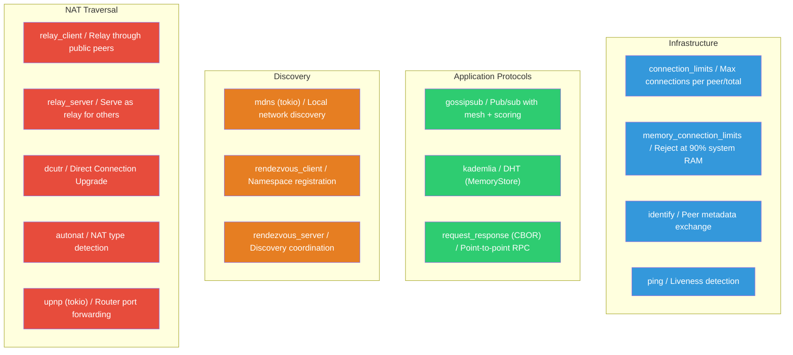

### 6.2 Sub-Behaviour Rationale

| Behaviour | Protocol | Why Included | Could Be Optional? |
|-----------|----------|-------------|-------------------|
| `connection_limits` | N/A (local enforcement) | Prevents connection exhaustion attacks | No -- always needed |
| `memory_connection_limits` | N/A (local enforcement) | Rejects connections at 90% memory | No -- safety net |
| `identify` | /ipfs/id/1.0.0 | Required by GossipSub for peer metadata | No -- protocol dependency |
| `ping` | /ipfs/ping/1.0.0 | Liveness detection, connection keep-alive | Could be, but ~zero cost |
| `gossipsub` | /meshsub/1.1.0 | Core messaging protocol | Yes (future: config-driven) |
| `kademlia` | /ipfs/kad/1.0.0 | DHT for content routing + peer discovery | Yes (future: config-driven) |
| `request_response` | /ex-libp2p/rpc/1.0.0 | Point-to-point RPC (used by Distribution) | Yes (future: config-driven) |
| `rendezvous_client` | /rendezvous/1.0.0 | Namespace-based discovery | Yes (config: enable_rendezvous_client) |
| `rendezvous_server` | /rendezvous/1.0.0 | Serve discovery for others | Yes (config: enable_rendezvous_server) |
| `mdns` | mDNS (multicast DNS) | Local network peer discovery | Yes (config: enable_mdns) |
| `relay_client` | /libp2p/circuit/relay/0.2.0 | NAT traversal via relay | Injected by SwarmBuilder |
| `relay_server` | /libp2p/circuit/relay/0.2.0 | Serve as relay for NATted peers | Yes (config: enable_relay_server) |
| `dcutr` | /libp2p/dcutr | Direct connection upgrade through relay | Yes (requires relay_client) |
| `autonat` | /libp2p/autonat/1.0.0 | Detect NAT status (public/private/unknown) | Yes (config: enable_autonat) |
| `upnp` | UPnP IGD | Automatic router port forwarding | Yes (config: enable_upnp) |

### 6.3 The Derive Macro and Generated Code

`#[derive(NetworkBehaviour)]` generates:

1. A `NodeBehaviourEvent` enum with one variant per sub-behaviour
2. A `poll()` implementation that polls all sub-behaviours and merges events
3. `ConnectionHandler` delegation

The generated event enum looks approximately like:

```rust
// Generated by #[derive(NetworkBehaviour)]
pub enum NodeBehaviourEvent {
    ConnectionLimits(connection_limits::Event),
    MemoryLimits(memory_connection_limits::Event),
    Identify(identify::Event),
    Ping(ping::Event),
    Gossipsub(gossipsub::Event),
    Kademlia(kad::Event),
    RequestResponse(request_response::Event<Vec<u8>, Vec<u8>>),
    RendezvousClient(rendezvous::client::Event),
    RendezvousServer(rendezvous::server::Event),
    Mdns(mdns::Event),
    RelayClient(relay::client::Event),
    RelayServer(relay::Event),
    Dcutr(dcutr::Event),
    Autonat(autonat::Event),
    Upnp(upnp::Event),
}
```

### 6.4 SwarmBuilder Typestate and relay_client Injection

The SwarmBuilder uses a typestate pattern that changes its API based on
what has been configured:


The critical detail is `with_relay_client()`: this method changes the
signature of the `with_behaviour` closure from `|key|` to `|key, relay_client|`.
The relay client behaviour is injected by the builder, not constructed
manually:

```rust
.with_relay_client(noise::Config::new, yamux::Config::default)
.map_err(|e| format!("relay client: {e}"))?
.with_bandwidth_metrics(&mut libp2p::metrics::Registry::default())
.with_behaviour(|key, relay_client| {
    // relay_client is provided by the builder
    Ok(NodeBehaviour {
        relay_client,  // <-- injected, not constructed
        // ...
    })
})
```

This is because the relay client transport is integrated at the transport
layer (it provides a new way to establish connections), and the builder
needs to wire the transport and behaviour together internally.

### 6.5 Protocol Negotiation

When two libp2p nodes connect, they negotiate which protocols to use via
multistream-select:

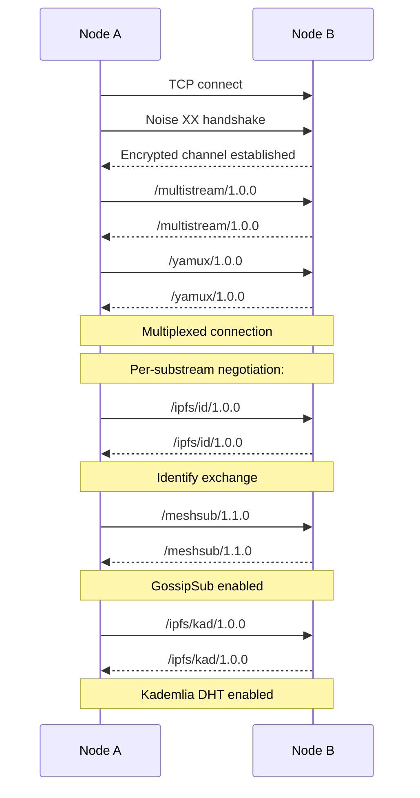

Each sub-behaviour in `NodeBehaviour` registers its protocol string.
Multistream-select tries each protocol, and the peer responds with the
ones it supports. Protocols that both sides support are activated.

### 6.6 Config-Driven Protocol Enables

The config struct includes boolean flags for optional protocols:

```elixir
# Node.Config struct (defaults)
enable_mdns: true,
enable_kademlia: true,
enable_relay: false,
enable_relay_server: false,
enable_autonat: false,
enable_upnp: false,
enable_websocket: false,
enable_rendezvous_client: false,
enable_rendezvous_server: false,
```

Currently, all behaviours are always included in the `NodeBehaviour` struct.
The enable flags are parsed in `config.rs` but not yet used to conditionally
include/exclude behaviours. This is because `#[derive(NetworkBehaviour)]`
generates a fixed struct -- conditional fields require either:

1. `Option<T>` wrapping (not supported by the derive macro)
2. `libp2p::swarm::behaviour::toggle::Toggle<T>` wrapper
3. Multiple behaviour structs with different compositions

This is tracked as future work (Section 10).

---

## 7. OTP Integration

### 7.1 GenServer as the Hub

The `ExLibp2p.Node` GenServer is the central coordination point:

```mermaid
graph TB
    subgraph "Client API"
        App["Application Code"]
        Ctx["Context Modules / (Gossipsub, DHT, etc.)"]
    end

    subgraph "Node GenServer"
        GS["ExLibp2p.Node / (GenServer)"]
        State["State: / - handle (ResourceArc) / - peer_id / - native module / - event_handlers / - monitors"]
    end

    subgraph "NIF Layer"
        NIF["state.native.*(state.handle, ...)"]
    end

    subgraph "Dependents"
        Health["ExLibp2p.Health"]
        Dist["Distribution.Server"]
        TT["TaskTracker"]
    end

    App --> Ctx
    Ctx --> GS
    GS --> State
    GS --> NIF
    Health --> GS
    Dist --> GS
    TT --> GS

    style GS fill:#9b59b6,color:#fff
    style NIF fill:#e74c3c,color:#fff
```

Design principle: **single writer to the NIF handle.** All NIF calls go
through the GenServer, serialized by its mailbox. This provides:

1. **Thread safety**: Only one GenServer.call is processed at a time
2. **State consistency**: The GenServer can maintain event handler state
   alongside the NIF handle
3. **Clean shutdown**: The GenServer's `terminate/2` callback calls
   `native.stop_node(handle)`
4. **Supervision**: The GenServer can be supervised, restarted, and
   monitored using standard OTP tools

### 7.2 Supervision Strategy: rest_for_one

The recommended supervision tree uses `rest_for_one`:

```mermaid
graph TB
    Sup["Supervisor / strategy: :rest_for_one"]
    Node["ExLibp2p.Node / (must start first)"]
    Health["ExLibp2p.Health / (depends on Node)"]
    Dist["Distribution.Server / (depends on Node)"]
    TT["TaskTracker / (depends on Node)"]

    Sup --> Node
    Sup --> Health
    Sup --> Dist
    Sup --> TT

    style Sup fill:#3498db,color:#fff
    style Node fill:#9b59b6,color:#fff
    style Health fill:#2ecc71,color:#fff
    style Dist fill:#2ecc71,color:#fff
    style TT fill:#2ecc71,color:#fff
```

**Why `rest_for_one`, not `one_for_one`?**

If the Node GenServer crashes:
- The NIF handle becomes invalid (the ResourceArc is dropped)
- Health, Distribution.Server, and TaskTracker all hold references to the
  Node GenServer (by name or PID)
- With `one_for_one`, these dependents would keep running with stale
  references, producing confusing errors
- With `rest_for_one`, a Node crash restarts all subsequent children,
  giving them fresh references to the restarted Node

If Health crashes:
- Only Health is restarted (it is the last child)
- Node, Distribution.Server, and TaskTracker are unaffected

```mermaid
sequenceDiagram
    participant Sup as Supervisor
    participant Node as Node GenServer
    participant Health as Health
    participant Dist as Distribution.Server
    participant TT as TaskTracker

    Note over Node: Node crashes!
    Node->>Sup: EXIT signal
    Sup->>Health: terminate rest_for_one
    Sup->>Dist: terminate rest_for_one
    Sup->>TT: terminate rest_for_one

    Sup->>Node: restart init with fresh config
    Node-->>Sup: :ok, state new NIF handle
    Sup->>Health: restart init with node: restarted_node
    Sup->>Dist: restart init with node: restarted_node
    Sup->>TT: restart init with node: restarted_node
```

### 7.3 The Distribution Layer

`ExLibp2p.OTP.Distribution` provides transparent `GenServer.call` over
libp2p, similar to Distributed Erlang's `GenServer.call({name, node}, msg)`:

```mermaid
sequenceDiagram
    participant Caller as Caller Process
    participant Dist as Distribution
    participant RR as RequestResponse
    participant Node as Node GenServer
    participant NIF as NIF Layer
    participant Net as Network
    participant Remote as Remote Node

    Caller->>Dist: callnode, peer, :server, :ping
    Dist->>Dist: encode:call, :server, :ping
    Dist->>RR: send_requestnode, peer, payload
    RR->>Node: GenServer.call:rpc_send_request, peer_str, data
    Node->>NIF: native.rpc_send_requesthandle, peer_str, data
    NIF->>Net: Command RpcSendRequest

    Net->>Remote: libp2p request-response
    Remote->>Remote: Distribution.Server handles
    Remote->>Remote: GenServer.call:server, :ping - reply
    Remote->>Net: response

    Net->>Node: :libp2p_event, :outbound_response, ...
    Node->>Caller: :libp2p, :outbound_response, %OutboundResponse

    Caller->>Dist: decoderesponse_data
    Dist-->>Caller: :ok, reply
```

### 7.4 Wire Format: term_to_binary with :safe Deserialization

The Distribution layer serializes Elixir terms for wire transmission:

```elixir
# Encoding
def encode(term) do
  :erlang.term_to_binary(term, [:compressed])
end

# Decoding (CRITICAL: uses :safe mode)
def decode(binary) when is_binary(binary) do
  {:ok, :erlang.binary_to_term(binary, [:safe])}
rescue
  ArgumentError -> {:error, :invalid_message}
end
```

The `:safe` option in `binary_to_term` is critical for security:

| Option | Atom Creation | Reference Creation | Function Creation |
|--------|--------------|-------------------|-------------------|
| (default) | Creates new atoms | Allowed | Allowed |
| `:safe` | Rejects unknown atoms | Rejected | Rejected |
| `:used` | Only existing atoms | Rejected | Rejected |

Without `:safe`, a malicious peer could:

1. **Atom table exhaustion**: Send terms with millions of unique atoms,
   exhausting the BEAM's atom table (fixed at ~1M atoms), crashing the VM
2. **Function injection**: Send function terms that execute arbitrary code
3. **Reference spoofing**: Create references that might match monitored
   processes

With `:safe`, the decode raises `ArgumentError` for any unknown atoms,
which is caught and returned as `{:error, :invalid_message}`. This is
the one legitimate use of `rescue` in the Distribution module — it is
a system boundary where untrusted binary data from the network is decoded.

### 7.4.1 Process Lookup: whereis Before Call

The Distribution server dispatches inbound calls to locally registered
GenServers. Rather than using `try/catch` around `GenServer.call`
(which would catch exits for nonexistent processes), the implementation
checks `Process.whereis` first:

```elixir
def handle_remote_request({:call, name, message}) do
  case whereis(name) do
    nil ->
      {:ok, encode({:error, :noproc})}

    pid ->
      case safe_call(pid, message) do
        {:ok, reply} -> {:ok, encode({:reply, reply})}
        {:error, reason} -> {:ok, encode({:error, reason})}
      end
  end
end

defp whereis(name) when is_atom(name), do: Process.whereis(name)
defp whereis({:via, registry, key}), do: GenServer.whereis({:via, registry, key})
```

The only remaining `catch :exit` is in `safe_call/2`, which wraps
`GenServer.call`. This is necessary because the process could die
between the `whereis` check and the call (a TOCTOU race). The
`catch :exit` at this point is a system boundary — calling into
a process we don't control:

```elixir
defp safe_call(pid, message) do
  {:ok, GenServer.call(pid, message, @call_timeout)}
catch
  :exit, {:noproc, _} -> {:error, :noproc}
  :exit, {:timeout, _} -> {:error, :timeout}
  :exit, reason -> {:error, {:exit, inspect(reason)}}
end
```

This pattern follows the Elixir convention: use ok/error tuples for
expected failures, reserve `try/catch/rescue` for system boundaries only.
The `cast` and `send` handlers use `whereis` without any catch — sending
to a PID never raises.

### 7.5 Security Properties

The Distribution layer inherits security from multiple levels:

```mermaid
graph TB
    subgraph "Transport Security"
        A["Noise XX (X25519 + ChaChaPoly)"]
        B["Authenticated by PeerId (Ed25519 public key hash)"]
        C["Forward secrecy (ephemeral keys per session)"]
    end

    subgraph "Application Security"
        D[":safe binary_to_term (no atom creation)"]
        E["ArgumentError caught on malformed data"]
        F["GenServer.call timeout (5s default)"]
    end

    subgraph "Resource Protection"
        G["connection_limits (per-peer, total)"]
        H["memory_connection_limits (90% threshold)"]
        I["GossipSub peer scoring"]
    end

    style A fill:#e74c3c,color:#fff
    style B fill:#e74c3c,color:#fff
    style C fill:#e74c3c,color:#fff
    style D fill:#e67e22,color:#fff
    style E fill:#e67e22,color:#fff
    style F fill:#e67e22,color:#fff
    style G fill:#3498db,color:#fff
    style H fill:#3498db,color:#fff
    style I fill:#3498db,color:#fff
```

### 7.6 TaskTracker: Distributed Work Tracking

The `ExLibp2p.OTP.TaskTracker` solves a specific problem: when work is
dispatched to a remote peer and that peer disconnects before completing
the work, how do we detect and recover?

```mermaid
stateDiagram-v2
    [*] --> Pending : dispatch(tracker, peer, target, message)
    Pending --> Completed : complete(tracker, task_id)
    Pending --> Failed : fail(tracker, task_id, reason)
    Pending --> PeerLost : Peer disconnects (automatic)

    Completed --> [*] : cleanup()
    Failed --> [*] : cleanup()
    PeerLost --> [*] : cleanup()

```

When a task enters **PeerLost**, all subscribers receive `{:task_tracker, :peer_lost, peer_id, orphaned_tasks}`.

The TaskTracker:
1. Registers for `:connection_closed` events from the Node
2. When a connection closes with `num_established: 0` (last connection to
   that peer), it scans for pending tasks assigned to that peer
3. Marks those tasks as `{:failed, :peer_lost}`
4. Notifies all subscribers with the list of orphaned tasks
5. Subscribers can then re-dispatch the work to another peer

```elixir
# Detection: connection_closed with num_established: 0
def handle_info(
      {:libp2p, :connection_closed,
       %Event.ConnectionClosed{peer_id: peer_id, num_established: 0}},
      state
    ) do
  # Find and mark orphaned tasks in one pass
  {updated_tasks, orphaned} =
    Enum.reduce(state.tasks, {state.tasks, []}, fn
      {id, %{status: :pending, peer_id: ^peer_id} = task}, {tasks_acc, orphaned_acc} ->
        failed = %{task | status: {:failed, :peer_lost}}
        {Map.put(tasks_acc, id, failed), [failed | orphaned_acc]}
      _entry, acc -> acc
    end)

  # Notify subscribers
  for pid <- state.subscribers, Process.alive?(pid) do
    Kernel.send(pid, {:task_tracker, :peer_lost, peer_id, orphaned})
  end
end
```

Note the single-pass `Enum.reduce` with pin-matched `^peer_id` — this
replaces what was originally a triple iteration (filter + reduce + map)
with one pass that builds both the updated tasks map and the orphaned list.

The `pending_tasks` query helper uses a `for` comprehension with pattern
matching instead of `Map.values |> Enum.filter`:

```elixir
defp pending_tasks(state, extra_filter) do
  for {_id, %{status: :pending} = task} <- state.tasks, extra_filter.(task), do: task
end
```

This is more idiomatic Elixir for filtering maps — the pattern match
in the generator acts as a built-in filter, and the comprehension reads
as a declarative query.

### 7.7 Health Monitoring

The `ExLibp2p.Health` GenServer provides periodic health checks with
resilience to temporary node unresponsiveness:

```mermaid
graph TB
    subgraph "Health Check Cycle"
        Start["Timer fires / (:check message)"]
        Collect["collect_status(node) / safe_call for peer_id, peers, addrs"]
        Success{"Success?"}
        Telem["Emit telemetry: / [:ex_libp2p, :health, :check]"]
        Fail["Log warning / Increment consecutive_failures"]
        FailTelem["Emit telemetry: / [:ex_libp2p, :health, :check_failed]"]
        Schedule["schedule_check(interval)"]
    end

    Start --> Collect
    Collect --> Success
    Success -->|Yes| Telem
    Success -->|No| Fail
    Fail --> FailTelem
    Telem --> Schedule
    FailTelem --> Schedule
    Schedule --> Start

    style Start fill:#3498db,color:#fff
    style Success fill:#e67e22,color:#fff
    style Telem fill:#2ecc71,color:#fff
    style FailTelem fill:#e74c3c,color:#fff
```

The key design choice is `safe_call` with a timeout:

```elixir
defp safe_call(node, msg) do
  GenServer.call(node, msg, @check_timeout)
catch
  :exit, reason -> {:error, {:node_unavailable, reason}}
end
```

If the Node GenServer is busy (processing a heavy NIF call, for example),
the health check times out after 10 seconds and continues running. It does
not crash -- it increments `consecutive_failures` and tries again on the
next interval.

This is important because a health monitor that crashes when the monitored
service is slow defeats its purpose.

---

## 8. Configuration Design

### 8.1 Why a Config Struct Instead of a Keyword List?

ExLibp2p uses a `%Config{}` struct instead of a raw keyword list:

```elixir
defmodule ExLibp2p.Node.Config do
  defstruct keypair_bytes: nil,
            listen_addrs: ["/ip4/0.0.0.0/tcp/0"],
            bootstrap_peers: [],
            gossipsub_mesh_n: 6,
            gossipsub_mesh_n_low: 4,
            # ... 30+ fields with defaults
end
```

| Approach | Type Safety | Defaults | Validation | IDE Support | Unknown Key Detection |
|----------|-----------|----------|-----------|-------------|---------------------|
| Keyword list | None | Manual `Keyword.get/3` | Manual | None | None |
| Map | None | Manual `Map.get/3` | Manual | None | None |
| **Config struct** | Compile-time | Struct defaults | `validate/1` | Field autocomplete | `Keyword.validate!/2` at construction |

Key benefits:

1. **Unknown key detection**: `Config.new(unknwon_key: true)` raises
   `ArgumentError` at construction time, not silently ignores it:

   ```elixir
   def new(opts) when is_list(opts) do
     Keyword.validate!(opts, @known_keys)  # Raises on unknown keys
     struct!(__MODULE__, opts)
   end
   ```

2. **Typed defaults**: Each field has a documented default value in the
   struct definition. No `Keyword.get(opts, :mesh_n, 6)` scattered across
   the codebase.

3. **Validation**: The `validate/1` function checks invariants:

   ```elixir
   def validate(%__MODULE__{listen_addrs: []}), do: {:error, :no_listen_addrs}
   def validate(%__MODULE__{idle_connection_timeout_secs: t}) when t <= 0,
     do: {:error, :invalid_timeout}
   def validate(%__MODULE__{} = config), do: {:ok, config}
   ```

4. **Map conversion**: The struct converts cleanly to a map for the NIF:
   ```elixir
   config_map = valid_config |> Map.from_struct() |> stringify_keys()
   ```

### 8.2 Default Value Rationale

```mermaid
graph TB
    subgraph "GossipSub Defaults"
        MN["mesh_n: 6 / (target mesh peers per topic)"]
        MNL["mesh_n_low: 4 / (trigger grafting below this)"]
        MNH["mesh_n_high: 12 / (trigger pruning above this)"]
        GL["gossip_lazy: 6 / (gossip to this many non-mesh peers)"]
        MTS["max_transmit_size: 65,536 / (64KB per message)"]
        HB["heartbeat_interval: 1000ms / (mesh maintenance tick)"]
    end

    subgraph "Connection Defaults"
        MEI["max_established_incoming: 256"]
        MEO["max_established_outgoing: 256"]
        MPI["max_pending_incoming: 128"]
        MPO["max_pending_outgoing: 64"]
        MEPP["max_established_per_peer: 2"]
        ICT["idle_connection_timeout: 60s"]
    end

    subgraph "Relay Defaults"
        RMR["relay_max_reservations: 128"]
        RMC["relay_max_circuits: 16"]
        RMCD["relay_max_circuit_duration: 120s"]
        RMCB["relay_max_circuit_bytes: 131,072"]
    end

    style MN fill:#2ecc71,color:#fff
    style MNL fill:#2ecc71,color:#fff
    style MNH fill:#2ecc71,color:#fff
    style MEI fill:#3498db,color:#fff
    style MEO fill:#3498db,color:#fff
    style RMR fill:#e67e22,color:#fff
    style RMC fill:#e67e22,color:#fff
```

**GossipSub parameters (from the GossipSub spec):**

- `mesh_n = 6`: The target number of mesh peers per topic. This provides
  redundancy (message reaches you through 6 paths) while keeping bandwidth
  reasonable. The GossipSub spec recommends 6 as the default.
- `mesh_n_low = 4`: Below this, the node actively grafts new peers. The
  2-peer gap (6 - 4 = 2) provides hysteresis to prevent oscillation.
- `mesh_n_high = 12`: Above this, the node prunes excess peers. The
  6-peer gap (12 - 6 = 6) tolerates temporary spikes during churn.
- `heartbeat_interval = 1000ms`: Controls how often the mesh is maintained.
  Faster heartbeats detect issues sooner but increase control traffic.

**Connection limits:**

- `max_established_per_peer = 2`: Prevents a single peer from consuming
  many connection slots (eclipse attack). 2 allows for simultaneous
  inbound + outbound during dial.
- `max_pending_incoming = 128`: Limits half-open connections (SYN flood
  mitigation). Higher than outgoing because inbound is less controlled.
- `max_pending_outgoing = 64`: Limits concurrent dial attempts.

**Relay limits:**

- `max_reservations = 128`: How many peers can reserve a relay slot.
  Conservative to prevent resource exhaustion.
- `max_circuits = 16`: Active relay circuits. Each circuit consumes
  bandwidth and memory.
- `max_circuit_bytes = 131,072`: Per-circuit byte limit (128KB).
  Prevents relay abuse for bulk data transfer.

### 8.3 GossipSub Peer Scoring Configuration

The `PeerScore` and `Thresholds` structs provide Ethereum-inspired defaults:

```elixir
defmodule ExLibp2p.Gossipsub.PeerScore do
  defstruct ip_colocation_factor_weight: -53.0,
            ip_colocation_factor_threshold: 3.0,
            behaviour_penalty_weight: -15.92,
            behaviour_penalty_decay: 0.986
end

defmodule Thresholds do
  defstruct gossip_threshold: -4000.0,
            publish_threshold: -8000.0,
            graylist_threshold: -16_000.0,
            accept_px_threshold: 100.0,
            opportunistic_graft_threshold: 5.0
end
```

These defaults are derived from the Ethereum consensus layer (beacon chain)
scoring parameters, which are well-studied and battle-tested in a 500K+
validator network.

| Threshold | Value | Effect |
|-----------|-------|--------|
| `gossip_threshold` | -4000 | Below this: stop gossiping to the peer |
| `publish_threshold` | -8000 | Below this: stop publishing to the peer |
| `graylist_threshold` | -16000 | Below this: ignore all messages from the peer |
| `accept_px_threshold` | 100 | Above this: accept peer exchange suggestions |
| `opportunistic_graft_threshold` | 5 | Above this: graft peers opportunistically |

### 8.4 Config Flow Through the System

```mermaid
sequenceDiagram
    participant App as Application
    participant Node as Node.init/1
    participant Config as Config.new/1
    participant Val as Config.validate/1
    participant SK as stringify_keys/1
    participant NIF as native.start_node/1
    participant RC as config.rs::from_map/1

    App->>Node: start_linklisten_addrs: ..., enable_mdns: true
    Node->>Config: Config.newopts
    Config->>Config: Keyword.validate!opts, @known_keys
    Config-->>Node: %Config...
    Node->>Val: Config.validateconfig
    Val-->>Node: :ok, config
    Node->>SK: Map.from_structconfig | stringify_keys
    SK-->>Node: %"listen_addrs" = ..., "enable_mdns" = true
    Node->>NIF: native.start_nodeconfig_map
    NIF->>RC: NodeConfig from_map&config_map
    RC->>RC: get_string_list"listen_addrs"
    RC->>RC: get_bool"enable_mdns", true
    RC-->>NIF: OkNodeConfig...
```

---

## 9. Testing Strategy

### 9.1 Two-Tier Testing

ExLibp2p uses a two-tier testing approach:

```mermaid
graph TB
    subgraph "Tier 1: Mock NIF (fast, no compilation)"
        T1A["163 unit tests"]
        T1B["Run with: mix test"]
        T1C["Native module: ExLibp2p.Native.Mock"]
        T1D["Tests: Elixir logic, event parsing, / config validation, GenServer behavior"]
    end

    subgraph "Tier 2: Real NIF (slow, comprehensive)"
        T2A["65+ integration tests"]
        T2B["Run with: mix test --include integration"]
        T2C["Native module: ExLibp2p.Native.Nif"]
        T2D["Tests: actual networking, protocol / negotiation, NAT traversal, security"]
    end

    style T1A fill:#2ecc71,color:#fff
    style T1B fill:#2ecc71,color:#fff
    style T1C fill:#2ecc71,color:#fff
    style T1D fill:#2ecc71,color:#fff
    style T2A fill:#e74c3c,color:#fff
    style T2B fill:#e74c3c,color:#fff
    style T2C fill:#e74c3c,color:#fff
    style T2D fill:#e74c3c,color:#fff
```

**Configuration for tier separation:**

```elixir
# config/test.exs
config :ex_libp2p, native_module: ExLibp2p.Native.Mock

# test/test_helper.exs
ExUnit.start(exclude: [:integration])

# mix.exs
defp aliases do
  [test: ["test --exclude integration"]]
end
```

Unit tests run in ~2 seconds with zero Rust compilation.
Integration tests require `mix test --include integration` and take 1-5
minutes depending on the test suite.

### 9.2 NifCase Helper

Integration tests use the `ExLibp2p.NifCase` case template:

```elixir
defmodule ExLibp2p.NifCase do
  use ExUnit.CaseTemplate

  using do
    quote do
      import ExLibp2p.NifCase
      @moduletag :integration
    end
  end

  def start_test_node(opts \\ []) do
    defaults = [
      listen_addrs: ["/ip4/127.0.0.1/tcp/0"],
      enable_mdns: false,
      idle_connection_timeout_secs: 30
    ]
    merged = Keyword.merge(defaults, opts)
    ExLibp2p.Node.start_link(Keyword.put(merged, :native_module, ExLibp2p.Native.Nif))
  end
end
```

Key design choices:

1. **`127.0.0.1` instead of `0.0.0.0`**: Tests bind to localhost only,
   preventing interference with other network services and avoiding
   firewall prompts on macOS.

2. **`tcp/0` for random port**: Each test node gets a random available port,
   enabling parallel test execution without port conflicts.

3. **`enable_mdns: false` by default**: mDNS broadcasts to the local
   network. Enabling it in tests would cause test nodes to discover each
   other across test cases, creating non-deterministic behavior.

4. **`idle_connection_timeout_secs: 30`**: Shorter than the production
   default (60s) to speed up test cleanup.

5. **Always real NIF**: `native_module: ExLibp2p.Native.Nif` is forced.
   If the NIF is not compiled, the test fails explicitly rather than
   silently falling back to the mock.

### 9.3 ExUnit Tags for Test Categorization

```mermaid
graph TB
    All["mix test"]
    Int["mix test --include integration"]
    Soak["mix test --include soak --timeout 900000"]
    MDNS["mix test --include mdns"]
    Sec["mix test --include security"]

    All --> Unit["163 unit tests / (no tags required)"]
    Int --> Integration["65+ integration tests / (@moduletag :integration)"]
    Integration --> Soak_Tests["Soak test: 50 cycles / (@moduletag :soak)"]
    Integration --> MDNS_Tests["mDNS tests / (@moduletag :mdns)"]
    Integration --> Sec_Tests["Security tests: 11 vectors / (@moduletag :security)"]
    Integration --> Panic_Tests["Panic safety tests / (always :integration)"]

    style Unit fill:#2ecc71,color:#fff
    style Integration fill:#e67e22,color:#fff
    style Soak_Tests fill:#e74c3c,color:#fff
    style MDNS_Tests fill:#e74c3c,color:#fff
    style Sec_Tests fill:#e74c3c,color:#fff
    style Panic_Tests fill:#e74c3c,color:#fff
```

**Why separate mDNS tests?**

mDNS uses multicast UDP, which:
1. May not work in Docker containers (no multicast routing)
2. May be blocked by corporate firewalls
3. Can interfere with other services on the local network
4. Takes 3-5 seconds for discovery (slow for unit tests)

Isolating mDNS tests with the `:mdns` tag allows CI to exclude them
(`mix test --include integration --exclude mdns`) while still running
all other integration tests. The GitHub Actions CI workflow excludes
mDNS by default since GitHub-hosted runners lack multicast networking.

### 9.4 Soak Test Design

The soak test (`test/integration/soak_test.exs`) validates that the system
does not leak resources under sustained load:

```mermaid
graph TB
    subgraph "Soak Test: 50 Cycles"
        Boot["Bootstrap: 31 nodes (seed + 30 backbone)"]
        Baseline["Baseline: memory + process count after mesh forms"]

        subgraph "Each Cycle"
            PA["Phase A: 100 gossipsub messages / (10 publishers x 10 messages)"]
            PB["Phase B: 10 request-response exchanges / (random peer pairs)"]
            PC["Phase C: DHT put/get operations"]
            PD["Phase D: 5 nodes depart gracefully"]
            PE["Phase E: 2 nodes crash (Process.exit :kill)"]
            PF["Phase F: 5 new nodes join (mDNS)"]
            PG["Phase G: Measure memory + process count"]
        end

        Final["Final: cleanup, measure, assert"]
    end

    Boot --> Baseline
    Baseline --> PA
    PA --> PB --> PC --> PD --> PE --> PF --> PG
    PG -->|"Next cycle"| PA
    PG -->|"After 50 cycles"| Final

    style Boot fill:#3498db,color:#fff
    style Baseline fill:#3498db,color:#fff
    style PA fill:#2ecc71,color:#fff
    style PB fill:#2ecc71,color:#fff
    style PC fill:#2ecc71,color:#fff
    style PD fill:#e67e22,color:#fff
    style PE fill:#e74c3c,color:#fff
    style PF fill:#2ecc71,color:#fff
    style PG fill:#3498db,color:#fff
    style Final fill:#9b59b6,color:#fff
```

**Leak detection via linear regression:**

After 50 cycles, the test performs least-squares linear regression on the
steady-state measurements (second half, excluding warmup):

```elixir
# Least-squares linear regression slope
defp linear_slope(values) do
  n = length(values)
  xs = Enum.to_list(0..(n - 1))
  ys = Enum.map(values, &(&1 / 1.0))

  sum_x = Enum.sum(xs)
  sum_y = Enum.sum(ys)
  sum_xy = xs |> Enum.zip(ys) |> Enum.map(fn {x, y} -> x * y end) |> Enum.sum()
  sum_x2 = xs |> Enum.map(&(&1 * &1)) |> Enum.sum()

  denom = n * sum_x2 - sum_x * sum_x
  if denom == 0, do: 0.0, else: (n * sum_xy - sum_x * sum_y) / denom
end
```

Assertions:

| Metric | Threshold | Rationale |
|--------|-----------|-----------|
| Memory ratio (final/baseline) | < 1.2x | 20% headroom for GC timing |
| Process growth | < 50 | Churn creates/destroys processes; net should be ~0 |
| Memory slope (per cycle) | < 0.5% of avg | Positive slope = leak signature |
| Process slope (per cycle) | < 1.0/cycle | Growing process count = handle leak |
| Binary memory slope | < 1.0% of avg | NIF-allocated binaries are a common leak source |

### 9.5 Security Test Coverage

The security test suite covers 11 attack vectors:

```mermaid
graph TB
    subgraph "Resource Exhaustion"
        S1["Connection limits / (10 attackers vs 3-max target)"]
        S2["Per-peer eclipse prevention / (1 attacker, many connections)"]
        S3["Message flood resilience / (1000 rapid gossipsub messages)"]
    end

    subgraph "Input Validation"
        S4["Invalid data handling / (empty, oversized messages)"]
        S5["Invalid multiaddr rejection / (empty, JS injection, overflow)"]
    end

    subgraph "Cryptographic Identity"
        S6["Unique identity per node / (20 nodes, all unique IDs)"]
        S7["Keypair persistence stability / (round-trip protobuf encoding)"]
    end

    subgraph "Resilience"
        S8["50% node loss recovery / (kill 10/20, survivors reconnect)"]
        S9["Event handler crash isolation / (handler crash does not crash node)"]
        S10["Rapid connect/disconnect / (20 cycles, no resource leak)"]
        S11["Concurrent API calls / (50 tasks x 10 ops each)"]
    end

    style S1 fill:#e74c3c,color:#fff
    style S2 fill:#e74c3c,color:#fff
    style S3 fill:#e74c3c,color:#fff
    style S4 fill:#e67e22,color:#fff
    style S5 fill:#e67e22,color:#fff
    style S6 fill:#3498db,color:#fff
    style S7 fill:#3498db,color:#fff
    style S8 fill:#2ecc71,color:#fff
    style S9 fill:#2ecc71,color:#fff
    style S10 fill:#2ecc71,color:#fff
    style S11 fill:#2ecc71,color:#fff
```

### 9.6 Panic Safety Test Suite

The panic safety tests (`test/integration/panic_safety_test.exs`) verify
that Rust-side panics cannot crash the BEAM:

| Test | Trigger | Expected Behavior |
|------|---------|-------------------|
| Invalid config | `listen_addrs: ["not-a-multiaddr"]` | `{:error, _}`, BEAM alive |
| Garbage keypair | `from_protobuf(random_bytes)` | `{:error, :invalid_keypair}`, BEAM alive |
| Operations on stopped node | `stop` then `peer_id` | Fails gracefully, new node works |
| Rapid create-destroy | 20 cycles of start/stop | All succeed, BEAM alive |
| Concurrent ops during shutdown | 10 tasks + stop | Tasks fail cleanly, BEAM alive |
| Crash and restart | Kill process, restart | Full functionality recovers |
| Supervisor restart | Kill supervised node | Supervisor restarts, new identity |

The most important assertion in every test:

```elixir
# After any dangerous operation:
assert Process.alive?(self())  # The BEAM is still running
```

### 9.7 Test Architecture Diagram

```mermaid
graph TB
    subgraph "Test Infrastructure"
        TH["test_helper.exs / ExUnit.start(exclude: [:integration])"]
        NC["NifCase / start_test_node/1 helper"]
        TM["TestMessages / (support module)"]
    end

    subgraph "Unit Tests (163, Mock NIF)"
        UT1["node_test.exs"]
        UT2["gossipsub_test.exs"]
        UT3["dht_test.exs"]
        UT4["discovery_test.exs"]
        UT5["keypair_test.exs"]
        UT6["peer_id_test.exs"]
        UT7["multiaddr_test.exs"]
        UT8["config_test.exs"]
        UT9["event_test.exs"]
        UT10["telemetry_test.exs"]
        UT11["health_test.exs"]
        UT12["metrics_test.exs"]
        UT13["relay_test.exs"]
        UT14["rendezvous_test.exs"]
        UT15["request_response_test.exs"]
        UT16["distribution_test.exs"]
        UT17["distribution_server_test.exs"]
        UT18["task_tracker_test.exs"]
        UT19["peer_score_test.exs"]
        UT20["ex_libp2p_test.exs"]
    end

    subgraph "Integration Tests (65+, Real NIF)"
        IT1["connectivity_test.exs"]
        IT2["gossipsub_test.exs"]
        IT3["gossipsub_advanced_test.exs"]
        IT4["dht_test.exs"]
        IT5["discovery_test.exs"]
        IT6["keypair_test.exs"]
        IT7["relay_test.exs"]
        IT8["rendezvous_test.exs"]
        IT9["request_response_test.exs"]
        IT10["node_lifecycle_test.exs"]
        IT11["metrics_test.exs"]
        IT12["capacity_test.exs"]
        IT13["stress_test.exs"]
        IT14["mdns_discovery_test.exs"]
        IT15["panic_safety_test.exs"]
        IT16["security_test.exs"]
        IT17["soak_test.exs"]
    end

    TH --> UT1
    NC --> IT1

    style TH fill:#95a5a6,color:#fff
    style NC fill:#95a5a6,color:#fff
    style UT1 fill:#2ecc71,color:#fff
    style UT2 fill:#2ecc71,color:#fff
    style UT3 fill:#2ecc71,color:#fff
    style UT4 fill:#2ecc71,color:#fff
    style UT5 fill:#2ecc71,color:#fff
    style IT1 fill:#e74c3c,color:#fff
    style IT2 fill:#e74c3c,color:#fff
    style IT3 fill:#e74c3c,color:#fff
    style IT15 fill:#e74c3c,color:#fff
    style IT16 fill:#e74c3c,color:#fff
    style IT17 fill:#e74c3c,color:#fff
```

---

## 10. Remaining Issues and Future Work

### 10.1 GenServer Bottleneck Under Extreme Load

The Node GenServer serializes all NIF calls through a single process
mailbox. Under extreme load (>10K calls/sec), this becomes a bottleneck:

```mermaid
graph LR
    C1["Caller 1"] -->|call| GS["Node GenServer / (single process)"]
    C2["Caller 2"] -->|call| GS
    C3["Caller 3"] -->|call| GS
    CN["Caller N"] -->|call| GS
    GS -->|sequential| NIF["NIF"]

    style GS fill:#e74c3c,color:#fff
```

**Potential solutions:**

1. **ETS cache for read-heavy operations**: Cache `connected_peers`,
   `listening_addrs`, and `mesh_peers` in ETS. The Swarm loop updates
   the cache on events (connection established/closed, new listen addr).
   Read operations bypass the GenServer entirely.

2. **Multiple Swarm instances**: For applications that need extreme
   throughput, run multiple Node GenServers with different Swarms.
   Each handles a subset of topics or protocols.

3. **Direct NIF bypass for pure reads**: Operations like `get_peer_id`
   that read immutable data from the `NodeHandle` could bypass the
   GenServer entirely (the handle is `Send + Sync` via `Arc`).

### 10.2 Kademlia Persistence

Currently, the DHT uses `MemoryStore`:

```rust
let store = kad::store::MemoryStore::new(local_peer_id);
let kademlia = kad::Behaviour::new(local_peer_id, store);
```

This means all DHT records are lost on restart. For applications that need
persistent DHT state, a disk-backed store is needed. rust-libp2p does not
provide one out of the box, but the `RecordStore` trait can be implemented
with any backend (SQLite, RocksDB, filesystem).

### 10.3 Per-Topic GossipSub Configuration

The `PeerScore.TopicParams` struct exists on the Elixir side but is not
yet wired through to the Rust NIF. Currently, all topics share the same
scoring parameters. Implementing per-topic configuration requires:

1. Passing a `HashMap<String, TopicParams>` through the NIF boundary
2. Calling `gossipsub::ConfigBuilder::default_topic_score()`
3. Calling `gossipsub::Behaviour::set_topic_params()` for each topic

### 10.4 Conditional Behaviour Inclusion

The `enable_*` config flags are parsed but not yet used to conditionally
include/exclude behaviours. Implementing this requires wrapping optional
behaviours in `libp2p::swarm::behaviour::toggle::Toggle<T>`:

```rust
// Future: conditional inclusion
pub struct NodeBehaviour {
    pub gossipsub: gossipsub::Behaviour,
    pub kademlia: Toggle<kad::Behaviour<kad::store::MemoryStore>>,  // Optional
    pub mdns: Toggle<mdns::tokio::Behaviour>,                        // Optional
    // ...
}
```

### 10.5 WebRTC/WebTransport for Browser Peers

libp2p supports WebRTC and WebTransport transports for browser-to-native
peer communication. Adding these would enable Elixir backend nodes to
communicate directly with JavaScript (browser) peers, useful for
decentralized web applications.

### 10.6 Multi-Node Integration Testing in CI

Currently, integration tests run nodes within a single BEAM VM. True
multi-node testing (separate VMs, possibly separate machines) would catch
issues related to:

- Network partitioning
- Clock skew
- Process isolation across VMs
- Distributed Erlang + libp2p coexistence

### 10.7 Precompiled NIF Distribution

The `Native.Nif` module already uses `RustlerPrecompiled`:

```elixir
use RustlerPrecompiled,
  otp_app: :ex_libp2p,
  crate: "ex_libp2p_nif",
  base_url: "https://github.com/badbeta/ex_libp2p/releases/download/v#{version}",
  force_build: System.get_env("EX_LIBP2P_BUILD") in ["1", "true"],
  targets: Enum.uniq(
    ["aarch64-apple-darwin", "x86_64-apple-darwin"] ++
      RustlerPrecompiled.Config.default_targets()
  ),
  version: version
```

A GitHub Actions workflow (`.github/workflows/precompile.yml`) is
configured to build NIFs for all targets on tag push (`v*`). It
cross-compiles for Linux (x86_64 + aarch64, GNU + musl) and macOS
(x86_64 + Apple Silicon) using `cross-rs`, then uploads tarballs
and SHA256 checksums to the GitHub release.

**For local development and contributors**, set the environment variable
`EX_LIBP2P_BUILD=true` to force compilation from source (requires a
Rust toolchain):

```bash
EX_LIBP2P_BUILD=true mix deps.get && mix compile
```

Without this variable, `RustlerPrecompiled` attempts to download a
precompiled binary from the `base_url`. If no release has been
published yet, compilation will fail — the `force_build` flag is the
workaround.

### 10.8 Connection Pool for Multiple Swarm Instances

For applications that need to partition network activity (e.g., separate
Swarms for different protocols, or separate Swarms for different network
segments), a connection pool abstraction could manage multiple Node
GenServers and route operations to the appropriate one.

### 10.9 Future Architecture Vision

```mermaid
graph TB
    subgraph "Current"
        C1["Single Node GenServer / Single Swarm / All protocols"]
    end

    subgraph "Future: Scalable"
        F1["Node Pool / (routes to appropriate Swarm)"]
        F2["Swarm A / (GossipSub + DHT)"]
        F3["Swarm B / (Request-Response)"]
        F4["ETS Cache / (read-heavy metrics)"]
        F5["Disk Store / (Kademlia persistence)"]
    end

    C1 -.->|evolves to| F1
    F1 --> F2
    F1 --> F3
    F2 --> F4
    F2 --> F5

    style C1 fill:#9b59b6,color:#fff
    style F1 fill:#3498db,color:#fff
    style F2 fill:#2ecc71,color:#fff
    style F3 fill:#2ecc71,color:#fff
    style F4 fill:#e67e22,color:#fff
    style F5 fill:#e67e22,color:#fff
```

### 10.10 Known Limitations Summary

| Limitation | Impact | Difficulty | Priority |
|-----------|--------|-----------|----------|
| GenServer bottleneck >10K calls/sec | High volume apps only | Medium (ETS cache) | Medium |
| No Kademlia persistence | DHT data lost on restart | Medium (RecordStore impl) | High |
| No per-topic scoring | All topics scored the same | Low (config plumbing) | Low |
| Behaviours always included | Slight memory overhead | Medium (Toggle wrapper) | Medium |
| Precompiled CI not triggered | CI configured but no release tag pushed yet | Low (tag push) | High |
| No WebRTC/WebTransport | No browser peers | High (transport additions) | Low |
| No multi-VM testing | Misses network-level bugs | Medium (CI infrastructure) | Medium |
| BandwidthStats may return (0, 0) | `with_bandwidth_metrics` called but counters may need verification | Low (verify + test) | Low |

---

## Appendix A: Atom Registry

The Rust side defines 46 atoms that must match the Elixir side:

```rust
rustler::atoms! {
    // Return codes
    ok, error, node_stopped, invalid_peer_id, invalid_multiaddr,
    already_subscribed, not_subscribed, publish_failed, dial_failed,
    keypair_generation_failed, runtime_creation_failed, nif_panic,

    // Event tags
    libp2p_event, libp2p_noop,
    connection_established, connection_closed, new_listen_addr,
    gossipsub_message, peer_discovered, dht_query_result,
    inbound_request, outbound_response,
    nat_status_changed, relay_reservation_accepted,
    hole_punch_outcome, external_addr_confirmed, dial_failure,

    // Connection endpoint
    dialer, listener,

    // DHT results
    found_record, not_found, put_record_ok, found_providers, bootstrap_ok,

    // NAT status
    public, private, unknown,

    // Hole punch
    success, failure,
}
```

These atoms are created when the NIF is loaded and live for the lifetime
of the BEAM VM. They are safe from atom table exhaustion because the count
is fixed at compile time.

---

## Appendix B: Telemetry Events

| Event Name | Measurements | Metadata | Emitted By |
|-----------|-------------|----------|------------|
| `[:ex_libp2p, :connection, :established]` | N/A | `%{peer_id, endpoint}` | Node GenServer |
| `[:ex_libp2p, :connection, :closed]` | N/A | `%{peer_id, cause}` | Node GenServer |
| `[:ex_libp2p, :gossipsub, :message_received]` | `%{size}` | `%{topic, source}` | Node GenServer |
| `[:ex_libp2p, :gossipsub, :message_published]` | `%{size}` | `%{topic}` | Node GenServer |
| `[:ex_libp2p, :dht, :query_completed]` | N/A | `%{query_id, result_type}` | Node GenServer |
| `[:ex_libp2p, :health, :check]` | `%{connected_peers}` | `%{peer_id}` | Health GenServer |
| `[:ex_libp2p, :health, :check_failed]` | `%{consecutive_failures}` | `%{reason}` | Health GenServer |
| `[:ex_libp2p, :node, :started]` | N/A | `%{peer_id}` | Node GenServer |
| `[:ex_libp2p, :node, :stopped]` | N/A | `%{peer_id, reason}` | Node GenServer |

Attach with:

```elixir
:telemetry.attach_many(
  "my-handler",
  ExLibp2p.Telemetry.event_names(),
  &handle_event/4,
  nil
)
```

---

## Appendix C: Complete Module Dependency Graph

```mermaid
graph TB
    ExLibp2p --> Node
    ExLibp2p --> Gossipsub
    ExLibp2p --> RequestResponse

    Node --> Native
    Node --> Config
    Node --> Event
    Node --> PeerId
    Node --> Multiaddr

    Native --> Nif
    Native --> Mock

    Gossipsub --> Node
    Gossipsub --> PeerId
    DHT --> Node
    DHT --> PeerId
    Discovery --> Node
    RequestResponse --> Node
    RequestResponse --> PeerId
    Relay --> Node
    Rendezvous --> Node
    Rendezvous --> PeerId
    Metrics --> Node
    Health --> Node

    Distribution --> Node
    Distribution --> PeerId
    Distribution --> RequestResponse
    DistributionServer --> Node
    DistributionServer --> RequestResponse
    DistributionServer --> Distribution
    TaskTracker --> Node
    TaskTracker --> PeerId

    Keypair --> Native
    PeerScore --> Node

    Event --> PeerId

    Telemetry

    style ExLibp2p fill:#9b59b6,color:#fff
    style Node fill:#9b59b6,color:#fff
    style Native fill:#e67e22,color:#fff
    style Nif fill:#e74c3c,color:#fff
    style Mock fill:#2ecc71,color:#fff
    style Config fill:#3498db,color:#fff
    style Event fill:#3498db,color:#fff
    style PeerId fill:#3498db,color:#fff
    style Multiaddr fill:#3498db,color:#fff
    style Gossipsub fill:#2ecc71,color:#fff
    style DHT fill:#2ecc71,color:#fff
    style Discovery fill:#2ecc71,color:#fff
    style RequestResponse fill:#2ecc71,color:#fff
    style Relay fill:#2ecc71,color:#fff
    style Rendezvous fill:#2ecc71,color:#fff
    style Metrics fill:#2ecc71,color:#fff
    style Health fill:#2ecc71,color:#fff
    style Distribution fill:#e67e22,color:#fff
    style DistributionServer fill:#e67e22,color:#fff
    style TaskTracker fill:#e67e22,color:#fff
    style Keypair fill:#3498db,color:#fff
    style PeerScore fill:#3498db,color:#fff
    style Telemetry fill:#95a5a6,color:#fff
```

---

## Appendix D: Rust Dependency Tree

```toml
[dependencies]
# NIF framework
rustler = "0.36.2"

# libp2p with 25 feature flags
libp2p = { version = "0.54", features = [
    "tokio", "tcp", "quic", "dns", "websocket",
    "noise", "tls", "pnet",
    "yamux",
    "gossipsub", "kad", "mdns", "identify", "ping",
    "request-response", "cbor", "json", "rendezvous",
    "relay", "dcutr", "autonat", "upnp",
    "macros", "metrics", "memory-connection-limits",
    "ecdsa", "secp256k1", "rsa",
] }

# Async runtime (shared OnceLock<Runtime> with 2 worker threads)
tokio = { version = "1", features = ["full"] }

# Stream combinators (select_next_some, FutureExt)
futures = "0.3"

# Structured logging
tracing = "0.1"

# Efficient mutex (unused currently, available for future use)
parking_lot = "0.12"
```

### Rust Edition

The project uses Rust edition 2024:

```toml
[package]
edition = "2024"
```

This provides access to the latest language features including:
- `let` chains in `if let`
- `async fn` in traits (nightly, but relevant for future libp2p versions)
- `gen` blocks (future use for iterators)

---

## Appendix E: Complete Swarm Event Loop Flow

```mermaid
flowchart TB
    Start["swarm_loop(swarm, cmd_rx)"]
    Select["tokio::select!"]

    subgraph "Command Branch"
        CmdRecv["cmd = cmd_rx.recv()"]
        CmdMatch{"Match command"}
        Dial["swarm.dial(addr)"]
        Publish["gossipsub.publish(topic, data)"]
        Subscribe["gossipsub.subscribe(topic)"]
        Query["reply.send(swarm.connected_peers())"]
        DhtOp["kademlia.put_record/get_record/..."]
        RpcReq["request_response.send_request(peer, data)"]
        RpcResp["pending_responses.remove(ch_id) / request_response.send_response(channel, data)"]
        RelayListen["swarm.listen_on(relay_addr)"]
        RvzOp["rendezvous_client.register/discover/..."]
        Shutdown["break"]
    end

    subgraph "Event Branch"
        EvRecv["event = swarm.select_next_some()"]
        EvMatch{"Match event"}
        RRInbound["Extract ResponseChannel / Store in pending_responses / send_inbound_request(pid, ...)"]
        RROutbound["send_outbound_response(pid, ...)"]
        Generic["handle_swarm_event(event, pid)"]
    end

    Start --> Select
    Select --> CmdRecv
    Select --> EvRecv

    CmdRecv --> CmdMatch
    CmdMatch -->|Dial| Dial
    CmdMatch -->|Publish| Publish
    CmdMatch -->|Subscribe| Subscribe
    CmdMatch -->|ConnectedPeers etc.| Query
    CmdMatch -->|DhtPut/Get/...| DhtOp
    CmdMatch -->|RpcSendRequest| RpcReq
    CmdMatch -->|RpcSendResponse| RpcResp
    CmdMatch -->|ListenViaRelay| RelayListen
    CmdMatch -->|RendezvousRegister/...| RvzOp
    CmdMatch -->|Shutdown/None| Shutdown

    EvRecv --> EvMatch
    EvMatch -->|"RR Message Request"| RRInbound
    EvMatch -->|"RR Message Response"| RROutbound
    EvMatch -->|"Everything else"| Generic

    Dial --> Select
    Publish --> Select
    Subscribe --> Select
    Query --> Select
    DhtOp --> Select
    RpcReq --> Select
    RpcResp --> Select
    RelayListen --> Select
    RvzOp --> Select
    RRInbound --> Select
    RROutbound --> Select
    Generic --> Select

    style Start fill:#3498db,color:#fff
    style Select fill:#e67e22,color:#fff
    style Shutdown fill:#e74c3c,color:#fff
    style RRInbound fill:#9b59b6,color:#fff
    style RROutbound fill:#9b59b6,color:#fff
```

---

## Appendix F: Design Decision Log

A chronological record of key decisions:

| # | Decision | Date | Alternatives Considered | Rationale |
|---|----------|------|------------------------|-----------|
| 1 | Wrap rust-libp2p via NIF (not port, not pure Elixir) | Project start | Port, Go daemon, pure Elixir | Performance, safety, ecosystem maturity |
| 2 | Command channel pattern (not direct Swarm access) | Project start | Direct NIF access | Swarm is !Sync, forces serialization |
| 3 | OnceLock<Runtime> with 2 worker threads | Project start | Thread-per-node, global runtime | Shared runtime avoids thread proliferation |
| 4 | @callback behaviour for NIF interface | Early | Mox directly, module attribute | Config-driven swap, compile-time default |
| 5 | Config struct (not keyword list) | Early | Keyword list, raw map | Type safety, validation, unknown key detection |
| 6 | String keys at NIF boundary | Early | Atom keys, NifStruct derive | Simpler Rust-side parsing, no atom issues |
| 7 | Tuples for event encoding (not maps) | Early | Maps, NifStruct | Performance on hot path, simpler Rust encoding |
| 8 | OwnedEnv::send_and_clear for events | Early | env.send() (unsafe from tokio) | Only safe cross-thread BEAM messaging |
| 9 | Channel ID HashMap for ResponseChannel | Mid | ResourceArc (impossible), global ID | ResponseChannel is !Clone + !Sync |
| 10 | rest_for_one supervision | Mid | one_for_one | Dependent processes need fresh Node references |
| 11 | :safe binary_to_term for Distribution | Mid | Default (unsafe) | Atom exhaustion prevention from untrusted peers |
| 12 | Two-tier testing (mock + real NIF) | Early | Mock only, real only | Fast CI + comprehensive verification |
| 13 | Linear regression in soak test | Late | Simple threshold | Detects gradual leaks, not just spikes |
| 14 | catch_unwind on start_node and swarm_loop | Mid | Rustler-only protection | Defense in depth, logging on panic |
| 15 | Unbounded channel (not bounded) | Project start | Bounded channel | NIF calls cannot block on Normal scheduler |
| 16 | Drop impl sends Shutdown | Early | Manual cleanup only | Ensures cleanup when ResourceArc is GC'd |
| 17 | RustlerPrecompiled for distribution | Late | Source compilation only | Zero Rust toolchain for end users |
| 18 | All behaviours always included | Current | Toggle-based conditional | Simpler, defer conditional to future |
| 19 | ProcessMonitor for handler cleanup | Mid | Manual unregister only | Prevents dead PID accumulation |
| 20 | Ed25519 + protobuf for keypair persistence | Early | Raw bytes, PEM | libp2p standard, self-describing format |

## 11. Alternative: Mesh Overlay Networks

This section evaluates whether a mesh overlay network — particularly
Yggdrasil — could replace the libp2p approach, simplifying the
architecture by eliminating the NIF boundary entirely.

### 11.1 What is Yggdrasil?

Yggdrasil is a fully decentralized, self-arranging IPv6 overlay network.
Each node gets a stable IPv6 address derived from its ed25519 public key
(in the `0200::/7` range), and standard TCP/UDP sockets work unchanged
over the overlay. Written in Go, alpha stage, ~5K GitHub stars, actively
maintained (v0.5.13, Feb 2026).

**How it works:**

```mermaid
flowchart TB
    subgraph Overlay["Yggdrasil IPv6 Overlay"]
        direction LR
        N1["Node A / 200:aaaa::1"] --- N2["Node B / 200:bbbb::2"]
        N2 --- N3["Node C / 200:cccc::3"]
        N1 --- N3
    end

    subgraph App["Application Layer"]
        direction LR
        BEAM1["BEAM VM"] ---|"standard :gen_tcp"| BEAM2["BEAM VM"]
    end

    App --> Overlay

    subgraph Transport["Physical Network"]
        direction LR
        ISP1["ISP / NAT"] --- Internet["Internet"] --- ISP2["ISP / NAT"]
    end

    Overlay --> Transport
```

- **Spanning tree routing** — nodes form a tree, packets route greedily
  toward destination coordinates in the tree's metric space
- **Bloom filter lookups** (v0.5+) — replaced DHT, constant state per peer,
  false positive rate ~2^-80 for leaf nodes
- **Encryption** — ed25519 identity + NaCl box (X25519/XSalsa20-Poly1305)
  with ratcheting for forward secrecy
- **Peering** — TCP, TLS, QUIC, WebSocket, UNIX sockets; local discovery
  via multicast
- **Self-healing** — reroutes around failed links in seconds

### 11.2 The Key Insight: Standard Sockets Over Encrypted IPv6

Yggdrasil's defining property for BEAM integration is that it provides
a regular IPv6 address. This means:

- **Distributed Erlang works natively** — configure `epmd` to listen on
  the Yggdrasil address, connect nodes with
  `Node.connect(:"app@[200:aaaa::1]")`
- **No NIF boundary needed** — all networking uses standard Elixir/Erlang
  socket modules (`:gen_tcp`, `:ssl`, `Req`, `Bandit`)
- **NAT traversal is solved at the network layer** — once a node has
  one outbound peering to a public node, it's reachable from the entire
  overlay network

This eliminates the entire three-layer architecture that ExLibp2p requires:

```mermaid
flowchart LR
    subgraph libp2p["libp2p Approach (current)"]
        direction TB
        E1["Elixir Layer"] --> NIF["NIF Boundary / Rustler"]
        NIF --> R1["Rust Async / tokio"]
        R1 --> Net1["Network"]
    end

    subgraph ygg["Yggdrasil Approach"]
        direction TB
        E2["Elixir Layer"] --> Sock["Standard Sockets"]
        Sock --> TUN["Yggdrasil TUN"]
        TUN --> Net2["Network"]
    end
```

### 11.3 Feature Comparison

| Capability | libp2p (ExLibp2p) | Yggdrasil + OTP | Winner |
|-----------|-------------------|-----------------|--------|
| **NAT traversal** | AutoNAT + Relay + DCUtR + UPnP (complex, ~70% hole punch success) | Automatic via outbound peering (near 100% reachability) | Yggdrasil |
| **Pub/Sub** | GossipSub v1.1 with peer scoring, content IDs, validation | Phoenix.PubSub over Distributed Erlang (no scoring, no dedup across slow links) | libp2p |
| **Content routing** | Kademlia DHT (find providers, store records) | None built-in; must implement with `:pg` or custom registry | libp2p |
| **Request/Response** | Built-in with CBOR framing, multiplexed streams | Standard HTTP/TCP/`:erpc.call` (works, less structured) | Tie |
| **Peer scoring** | GossipSub scores peers, penalizes misbehavior | None — must implement manually | libp2p |
| **Interoperability** | Rust, Go, JS, C++ libp2p implementations | Only Yggdrasil nodes (Go only) | libp2p |
| **Architecture complexity** | 3 layers, NIF boundary, Rust toolchain, dirty schedulers | 1 layer, standard OTP, Go sidecar daemon | Yggdrasil |
| **NIF crashes** | Possible (mitigated by catch_unwind) | Impossible (no NIF) | Yggdrasil |
| **OTP distribution** | Custom Distribution layer over request-response | Native Distributed Erlang — `:erpc`, `:pg`, Horde, DeltaCRDT all work | Yggdrasil |
| **Encryption** | Noise XX per connection | NaCl box with ratcheting, end-to-end | Tie |
| **Identity** | PeerId from ed25519 key hash | IPv6 from ed25519 key | Tie |
| **Maturity** | Production (Ethereum, Polkadot, IPFS use libp2p) | Alpha (community services, no large-scale production) | libp2p |
| **Ecosystem** | Large, multi-language, well-funded | Small, Go-only, community-driven | libp2p |

### 11.4 Architecture With Yggdrasil

If ExLibp2p were rebuilt on Yggdrasil, the architecture would look like:

```mermaid
flowchart TB
    subgraph App["Application"]
        direction LR
        MyApp["MyApp GenServer"]
        PubSub["Phoenix.PubSub / :pg"]
        RPC[":erpc / GenServer.call"]
    end

    subgraph OTP["OTP Distribution"]
        direction LR
        EPMD["epmd on Yggdrasil IPv6"]
        DistErl["Distributed Erlang"]
    end

    subgraph Yggdrasil["Yggdrasil Daemon (sidecar)"]
        direction LR
        TUN["TUN interface / 200::1/7"]
        Routing["Spanning tree routing"]
        Crypto["ed25519 + NaCl encryption"]
    end

    App --> OTP
    OTP --> Yggdrasil
```

**What stays:**
- Keypair management (same ed25519, just used for Yggdrasil address instead of PeerId)
- Telemetry and health monitoring
- The OTP.Distribution module (becomes trivial — just `:erpc.call`)
- TaskTracker (peer loss detection via `Node.monitor`)

**What disappears:**
- The entire Rust crate (1,644 lines)
- The NIF boundary (Native behaviour, Nif module, Mock module)
- Command channel architecture
- Event bridging (OwnedEnv)
- Dirty scheduler management
- catch_unwind panic safety
- 12-behaviour NetworkBehaviour composition
- GossipSub configuration (replaced by Phoenix.PubSub)

**What must be built new:**
- Yggdrasil daemon supervision (Port or MuonTrap)
- Phoenix.PubSub-based topic broadcasting (simpler than GossipSub but
  lacks peer scoring and message deduplication)
- Content routing if needed (`:pg` groups or broadcast-based lookup)

### 11.5 The Phoenix.PubSub Question

The biggest functional gap is pub/sub. GossipSub provides:

1. **Mesh topology** — D peers per topic, with grafting/pruning
2. **Peer scoring** — penalize spam, reward first-delivery
3. **Content-addressed message IDs** — deduplicate across mesh paths
4. **Configurable validation** — reject invalid messages before forwarding
5. **Fan-out optimization** — gossip IHAVE/IWANT for efficiency

Phoenix.PubSub with the PG adapter provides:

1. **Full broadcast** — all subscribers get all messages via `:pg`
2. **Per-node deduplication** — automatic (same BEAM node)
3. **No scoring** — all peers are equally trusted
4. **No mesh optimization** — full replication across all connected nodes
5. **Works over Distributed Erlang** — zero configuration

For trusted networks (internal services, IoT fleets, private clusters),
Phoenix.PubSub is sufficient and dramatically simpler. For untrusted
public networks (open P2P, cryptocurrency, content distribution),
GossipSub's scoring and validation are essential.

```mermaid
flowchart TD
    Q1{"Trusted network?"} -->|Yes| PubSub["Phoenix.PubSub / :pg / sufficient"]
    Q1 -->|No| Q2{"Need peer scoring?"} 
    Q2 -->|Yes| GossipSub["GossipSub / libp2p required"]
    Q2 -->|No| Q3{"Need content routing?"}
    Q3 -->|Yes| Kademlia["Kademlia DHT / libp2p required"]
    Q3 -->|No| Custom["Custom gossip over Yggdrasil / viable"]
```

### 11.6 When to Choose Each Approach

**Choose Yggdrasil + OTP when:**

- All nodes run BEAM VMs (or can be reached via subnet routing)
- The network is trusted or semi-trusted (company fleet, IoT devices,
  private cluster)
- NAT traversal is a primary pain point
- Development velocity matters more than protocol sophistication
- You want to leverage the full OTP ecosystem (Horde, DeltaCRDT, :pg,
  Nx distributed training) without NIF complexity
- GossipSub peer scoring is not needed
- Content routing can be solved with a registry or `:pg` groups

**Choose libp2p (current approach) when:**

- Nodes run multiple languages (Rust, Go, JS — not just BEAM)
- The network is untrusted/public (open P2P, blockchain, content
  distribution)
- GossipSub peer scoring is required for spam/Sybil defense
- Kademlia DHT for content routing is required
- Interoperability with existing libp2p networks (IPFS, Ethereum,
  Polkadot) is needed
- Production maturity and ecosystem depth matter
- You need fine-grained control over protocol parameters

**Choose Headscale (WireGuard-based) when:**

- You can accept running a coordination server
- ACLs and DNS resolution are needed
- NAT traversal reliability is paramount (DERP relays are very reliable)
- Production maturity is the top priority
- The network is private but needs strong access control

### 11.7 Other Overlay Networks

| Overlay | Architecture | Decentralized? | Maturity | Best for |
|---------|-------------|:-:|----------|----------|
| **Yggdrasil** | Spanning tree + bloom filters, IPv6 | Fully | Alpha | Fully P2P, zero-infra BEAM apps |
| **CJDNS** | Kademlia DHT routing, IPv6 | Fully | Stale | Legacy — Yggdrasil is its successor |
| **Tailscale/Headscale** | WireGuard + coordination server | No | Production | Private networks with ACLs |
| **ZeroTier** | L2 Ethernet overlay + controller | No | Production | Virtual LANs, gaming |
| **Nebula** | Certificate-based mesh, Noise | Partially | Production | Corporate mesh with PKI |

### 11.8 Hybrid: Yggdrasil Transport + Custom Gossip

A compelling middle ground: use Yggdrasil for transport and implement
a lightweight gossip protocol in pure Elixir. This avoids the NIF
boundary while providing GossipSub-like semantics:

```elixir
defmodule MyApp.Gossip do
  @moduledoc """
  Lightweight gossip protocol over Distributed Erlang / Yggdrasil.
  Not a full GossipSub replacement — no peer scoring.
  """
  use GenServer

  @fanout 6
  @seen_ttl :timer.minutes(5)

  def publish(topic, data) do
    msg_id = :crypto.hash(:sha256, data) |> Base.encode16()
    broadcast(topic, msg_id, data, MapSet.new())
  end

  defp broadcast(topic, msg_id, data, seen) do
    # Get all nodes subscribed to this topic via :pg
    members = :pg.get_members(:gossip, topic) -- [self()]

    # Random fanout to avoid flooding
    targets = Enum.take_random(members, @fanout)

    for pid <- targets do
      send(pid, {:gossip, topic, msg_id, data})
    end
  end

  def handle_info({:gossip, topic, msg_id, data}, state) do
    if MapSet.member?(state.seen, msg_id) do
      # Already seen — deduplicate
      {:noreply, state}
    else
      # New message — deliver to local subscribers and re-gossip
      dispatch_local(topic, data)
      seen = MapSet.put(state.seen, msg_id)
      broadcast(topic, msg_id, data, seen)
      {:noreply, %{state | seen: seen}}
    end
  end
end
```

This provides content-addressed deduplication and random fan-out — the
two most valuable GossipSub properties — in ~40 lines of pure Elixir.
Missing: peer scoring, configurable mesh degree, IHAVE/IWANT
optimization, message validation hooks. These could be added
incrementally if needed.

### 11.9 Assessment for ExLibp2p

ExLibp2p chose libp2p because the project goals include:

1. **Multi-language interop** — libp2p has Rust, Go, JS, C++ implementations
2. **Untrusted network operation** — GossipSub peer scoring is required
3. **Content routing** — Kademlia DHT for provider discovery
4. **Ecosystem compatibility** — interop with IPFS, Ethereum, Polkadot nodes
5. **Production maturity** — libp2p is battle-tested at scale

For these requirements, Yggdrasil would not be sufficient. However,
for a simpler project — a private BEAM cluster, an IoT fleet with
Nerves devices, or an internal pub/sub system — the Yggdrasil + OTP
approach would eliminate the entire Rust NIF layer and produce a
dramatically simpler system.

**The key question to ask:** "Do all my peers run Elixir/Erlang, and
is my network trusted?" If yes, Yggdrasil + Distributed Erlang is
almost certainly the better choice. If no, libp2p is the right tool.

```mermaid
flowchart TD
    Start{"All peers run BEAM?"} -->|No| LP["libp2p: multi-language protocol framework"]
    Start -->|Yes| Q2{"Trusted / private network?"}
    Q2 -->|No| Q3{"Need GossipSub scoring?"}
    Q2 -->|Yes| Q4{"Accept coordination server?"}
    Q3 -->|Yes| LP
    Q3 -->|No| YG["Yggdrasil + custom gossip in Elixir"]
    Q4 -->|Yes| HS["Headscale + Distributed Erlang"]
    Q4 -->|No| YG
```

---

*This document was written to serve as both a contributor reference and
educational material for developers learning about NIF architecture,
Elixir/Rust interop, and libp2p networking.*
