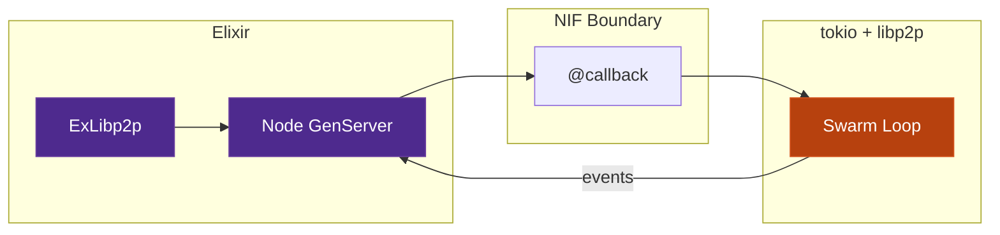

# ExLibp2p

> A full experimental Elixir wrapper for the Rust libp2p library with some OTP application layer on top. More info in the [documentation](ARCHITECTURE.md). Not for production use.

Idiomatic Elixir wrapper for [rust-libp2p](https://github.com/libp2p/rust-libp2p) — peer-to-peer networking with full OTP integration.



## Installation

```elixir
def deps do
  [{:ex_libp2p, "~> 0.1.0"}]
end
```

Precompiled NIFs are provided for Linux (x86_64, aarch64) and macOS (x86_64, Apple Silicon).
For local development or unsupported platforms, set `EX_LIBP2P_BUILD=true` to compile from source (requires Rust toolchain).

## Quick Start

```elixir
# Start a node
{:ok, node} = ExLibp2p.Node.start_link(
  listen_addrs: ["/ip4/0.0.0.0/tcp/0"],
  enable_mdns: true,
  gossipsub_topics: ["chat"]
)

# Publish a message
:ok = ExLibp2p.publish(node, "chat", "hello network")

# Register for messages
ExLibp2p.Gossipsub.register_handler(node)
# Receive in handle_info: {:libp2p, :gossipsub_message, %GossipsubMessage{}}
```

## Modules

| Module | Purpose |
|--------|---------|
| `ExLibp2p.Node` | Core GenServer — lifecycle, connections |
| `ExLibp2p.Gossipsub` | Publish-subscribe messaging |
| `ExLibp2p.DHT` | Distributed hash table (Kademlia) |
| `ExLibp2p.RequestResponse` | Point-to-point RPC |
| `ExLibp2p.Discovery` | mDNS + bootstrap |
| `ExLibp2p.Relay` | NAT traversal via circuit relay |
| `ExLibp2p.Rendezvous` | Namespace-based discovery |
| `ExLibp2p.Keypair` | Identity management |
| `ExLibp2p.Metrics` | Bandwidth stats |
| `ExLibp2p.Health` | Periodic health checks |
| `ExLibp2p.OTP.Distribution` | Remote GenServer call/cast/send |
| `ExLibp2p.OTP.TaskTracker` | Track work, detect peer loss |

## OTP Distribution

Transparent GenServer calls across the P2P network:

```elixir
# Call a GenServer on a remote peer
{:ok, result} = ExLibp2p.OTP.Distribution.call(node, peer_id, :my_server, :ping)

# Track work and detect peer disappearance
{:ok, task_id} = ExLibp2p.OTP.TaskTracker.dispatch(tracker, peer_id, :worker, job)
# If peer disappears: {:task_tracker, :peer_lost, peer_id, orphaned_tasks}
```

## Supervision

```elixir
children = [
  {ExLibp2p.Node, name: :p2p, listen_addrs: ["/ip4/0.0.0.0/tcp/0"]},
  {ExLibp2p.Health, node: :p2p},
  {ExLibp2p.OTP.Distribution.Server, node: :p2p},
  {ExLibp2p.OTP.TaskTracker, node: :p2p}
]

Supervisor.start_link(children, strategy: :rest_for_one)
```

## Security

- All connections encrypted (Noise XX: X25519 + ChaChaPoly)
- Mutual Ed25519 authentication via PeerId
- Connection + memory limits prevent resource exhaustion
- GossipSub peer scoring (v1.1) penalizes misbehaving peers
- `catch_unwind` on NIF — Rust panics cannot crash the BEAM
- `:safe` mode for `binary_to_term` — prevents atom exhaustion

## Testing

```bash
mix test                                          # Unit tests (mock NIF)
mix test --include integration                    # Real NIF tests
mix test --include soak --timeout 3600000         # 50-cycle leak test
mix test --include security --timeout 300000      # Security suite
```

163 unit tests, 39+ integration tests, zero Credo issues, zero Dialyzer errors.

## Documentation

- **[ARCHITECTURE.md](ARCHITECTURE.md)** — deep technical reference with Mermaid diagrams
- **`mix docs`** — ExDoc API documentation

## License

Apache-2.0
